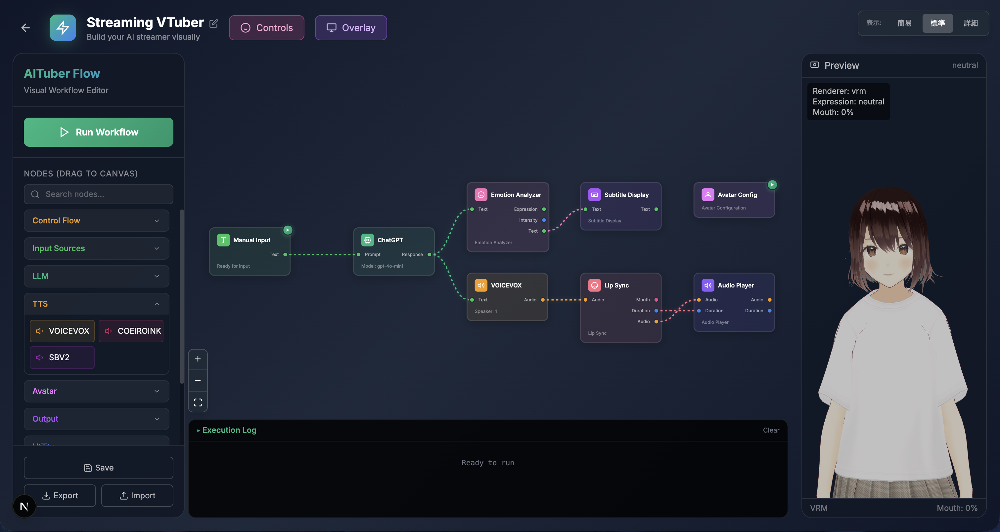

<p align="center">
  
</p>

<p align="center">
  <strong>Visual workflow editor for creating AI VTubers without coding</strong>
</p>

<p align="center">
  <a href="https://github.com/oboroge0/AITuberFlow/releases/latest"></a>
  <a href="https://codespaces.new/oboroge0/AITuberFlow"></a>
</p>

<p align="center">
  <a href="https://github.com/oboroge0/AITuberFlow/actions/workflows/ci.yml"></a>
  <a href="https://opensource.org/licenses/MIT"></a>
  <a href="https://github.com/oboroge0/AITuberFlow"></a>
  <a href="https://github.com/oboroge0/AITuberFlow/issues"></a>
</p>

<p align="center">
  <a href="README.md">日本語</a>
</p>

---

## Overview

AITuberFlow is a visual tool for building AI-powered virtual streamer (AITuber/VTuber) pipelines. Simply drag, drop, and connect nodes to create AI characters without writing code.

### Key Features

- **Desktop App** - Native app for macOS / Windows (Tauri v2)
- **Visual Editor** - Intuitive drag-and-drop interface
- **Plugin System** - Extensible architecture for custom nodes
- **Real-time Execution** - Live logs via native WebSocket
- **Multiple LLM Support** - OpenAI, Anthropic Claude, Google Gemini, Ollama
- **Multiple TTS Support** - VOICEVOX, COEIROINK, Style-Bert-VITS2
- **Control Flow** - Start, End, Loop, ForEach, Switch nodes for complex workflows
- **Avatar Support** - VRM model display with lip-sync and expressions
- **OBS Integration** - Scene switching and source control
- **Streaming Overlay** - OBS Browser Source compatible overlay
- **Demo Mode** - Test workflows without API keys
- **Workflow Sharing** - Import/export with automatic API key exclusion
- **GitHub Codespaces** - One-click cloud development environment

---

## 🚧 Development Status

> **⚡ Rapidly Evolving!**
>
> We're building fast to get this into your hands as soon as possible.
> Some rough edges exist, but we're improving every day.
>
> - 🐛 Found a bug? → Open an [Issue](https://github.com/oboroge0/AITuberFlow/issues)
> - 💡 Have an idea? → Join [Discussions](https://github.com/oboroge0/AITuberFlow/discussions)
> - 💬 Questions? → [X DM (@oboroge9)](https://x.com/oboroge9)
> - ⭐ Like this project? → Give us a Star!

---

## Screenshot


*Connect nodes to build your workflow*

---

## Tech Stack

<p align="center">
  
  
  
  
</p>
<p align="center">
  
  
  
  
</p>
<p align="center">
  
  
  
</p>

---

## Features

### Control Flow Nodes
| Node | Description |
|------|-------------|
| **Start** | Workflow entry point |
| **End** | Workflow termination point |
| **Loop** | Repeat processing a specified number of times |
| **ForEach** | Process each item in a list |
| **Switch** | Conditional branching |
| **Delay** | Add delay between operations |

### Input Nodes
| Node | Description |
|------|-------------|
| **Manual Input** | Enter text manually |
| **YouTube Chat** | Fetch YouTube Live chat messages |
| **Twitch Chat** | Fetch Twitch chat messages |
| **Discord Chat** | Fetch Discord channel messages |
| **Timer** | Trigger at regular intervals |

### LLM Nodes
| Node | Description |
|------|-------------|
| **ChatGPT** | OpenAI GPT models (GPT-4o, GPT-5, etc.) |
| **Claude** | Anthropic Claude models |
| **Gemini** | Google Gemini models |
| **Ollama** | Local LLMs via Ollama |

### TTS Nodes (Text-to-Speech)
| Node | Description |
|------|-------------|
| **VOICEVOX** | Free Japanese voice synthesis |
| **COEIROINK** | High-quality Japanese voice synthesis |
| **Style-Bert-VITS2** | Expressive voice synthesis |

### Avatar Nodes
| Node | Description |
|------|-------------|
| **Avatar Configuration** | Configure VRM model and settings |
| **Motion Trigger** | Trigger avatar animations |
| **Lip Sync** | Synchronize mouth movement with audio |
| **Emotion Analyzer** | Analyze text and set expressions |

### Utility Nodes
| Node | Description |
|------|-------------|
| **HTTP Request** | Call external APIs |
| **Text Transform** | Transform text (uppercase/lowercase/trim, etc.) |
| **Random** | Generate random numbers or selections |
| **Variable** | Store and retrieve variables |
| **Data Formatter** | Format and transform data |

### Output Nodes
| Node | Description |
|------|-------------|
| **Console Output** | Output to logs |
| **Audio Player** | Play synthesized audio |
| **Subtitle Display** | Display subtitles on overlay |

### OBS Integration Nodes
| Node | Description |
|------|-------------|
| **OBS Scene Switch** | Switch OBS scenes |
| **OBS Source Toggle** | Show/hide OBS sources |

> **Note:** OBS integration requires enabling the WebSocket server in OBS.

---

## Quick Start

### Get Started with GitHub Codespaces (Easiest)

[](https://codespaces.new/oboroge0/AITuberFlow)

Set up a development environment in your browser with one click. No local setup required!

### Desktop App (Easiest)

Download the installer from [GitHub Releases](https://github.com/oboroge0/AITuberFlow/releases/latest) and run it!

- **macOS**: DMG file (Apple Silicon / Intel)
- **Windows**: NSIS installer

The server starts automatically and the editor opens right away.

### Requirements (Local Development)

- **Node.js** 22 or higher
- **[Bun](https://bun.sh/)** 1.0 or higher
- **VOICEVOX** (optional, for voice synthesis)

### Setup

```bash
# Clone the repository
git clone https://github.com/oboroge0/AITuberFlow.git
cd AITuberFlow

# Install dependencies
npm install && npm run setup

# Start development servers (frontend + backend simultaneously)
npm run dev
```

The editor will be available at `http://localhost:3000`.

### Start Individually

```bash
# Frontend only
npm run dev:web

# Backend only
npm run dev:api
```

---

## Detailed Setup

### Backend

```bash
cd apps/server-ts

# Install dependencies
bun install

# Start the server
bun run dev
```

The backend will start at `http://localhost:8001`.

### Frontend

```bash
cd apps/web

# Install dependencies
npm install

# Start development server
npm run dev
```

The frontend will start at `http://localhost:3000`.

### VOICEVOX (Optional)

For voice synthesis, install and start [VOICEVOX](https://voicevox.hiroshiba.jp/).

By default, it connects to `http://localhost:50021`.

---

## Usage

### Basic Workflow

1. Open `http://localhost:3000` in your browser
2. Click "New Workflow" to create a new workflow
3. Drag nodes from the sidebar to the canvas
4. Connect nodes (drag from output port to input port)
5. Click a node to configure its settings
6. Click "Run Workflow" to execute

### Editor Controls

| Action | Description |
|--------|-------------|
| **Drag & Drop** | Add nodes from sidebar |
| **Connect** | Drag from output to input ports |
| **Right Click** | Show context menu |
| **Ctrl+Z** | Undo |
| **Ctrl+Y** | Redo |
| **Ctrl+C/V** | Copy & Paste |
| **Ctrl+S** | Save workflow |
| **Delete** | Delete selected nodes |

### Demo Mode

Test workflows without external services (LLM APIs, TTS engines).

- **LLM Nodes**: Automatically return demo responses when API key is not set
- **TTS Nodes**: Enable "Demo Mode" in settings to skip when TTS is unavailable

### Workflow Sharing (Import/Export)

Share workflows as JSON files using the sidebar buttons.

- **Export**: API keys are automatically excluded for security
- **Import**: Creates a new workflow and opens it automatically

### Start Node Behavior

- When a **Start node** is placed, only connected nodes will be executed
- Nodes not connected to Start are shown with dashed borders and won't execute
- Without a Start node, all nodes execute (backward compatibility)

### Example: AI Chatbot

```
[Manual Input] → [LLM] → [TTS] → [Audio Player]
```

1. **Manual Input**: Enter text
2. **LLM**: Configure OpenAI API key and system prompt
3. **TTS**: Select VOICEVOX speaker
4. **Audio Player**: Plays the generated audio

When executed, the AI responds to input and reads it aloud.

### Streaming Overlay

Access the OBS-compatible overlay at:
```
http://localhost:3000/overlay/{workflow-id}
```

Configure as a Browser Source in OBS with transparent background.

---

## Project Structure

```
AITuberFlow/
├── apps/
│   ├── web/             # Next.js frontend
│   ├── server-ts/       # Bun + Hono backend
│   └── desktop/         # Tauri v2 desktop app
├── packages/
│   └── sdk-ts/          # TypeScript plugin SDK
├── plugins/             # Official plugins (32+)
├── templates/           # Workflow templates
└── docs/                # Documentation
```

---

## Plugin Development

Create your own custom nodes:

```typescript
import { BaseNode, NodeContext } from "@aituber-flow/sdk";

class MyCustomNode extends BaseNode {
  async setup(config: Record<string, unknown>, context: NodeContext): Promise<void> {
    // Initialization
  }

  async execute(inputs: Record<string, unknown>, context: NodeContext): Promise<Record<string, unknown>> {
    const inputText = (inputs.text as string) || "";

    // Log output
    await context.log(`Processing: ${inputText}`);

    // Return result
    return { output: `Result: ${inputText}` };
  }

  async teardown(): Promise<void> {
    // Cleanup
  }
}
```

See the "Node Development" section in [CLAUDE.md](CLAUDE.md) for details.

---

## API Documentation

See [docs/api-reference.md](docs/api-reference.md) for the full API reference.

### Main Endpoints

| Method | Path | Description |
|--------|------|-------------|
| GET | `/api/workflows` | List workflows |
| POST | `/api/workflows` | Create workflow |
| GET | `/api/workflows/{id}` | Get workflow |
| PUT | `/api/workflows/{id}` | Update workflow |
| DELETE | `/api/workflows/{id}` | Delete workflow |
| POST | `/api/workflows/{id}/start` | Start workflow execution |
| POST | `/api/workflows/{id}/stop` | Stop workflow execution |

---

## Troubleshooting

### Cannot connect to backend

- Check if server is running (`http://localhost:8001/health`)
- Check firewall settings

### Cannot connect to VOICEVOX

- Ensure VOICEVOX is running
- Check TTS node host setting (default: `http://localhost:50021`)

### Audio not playing

- Browser autoplay policy may block initial playback
- Click anywhere on the page before running the workflow

### OBS nodes not working

- Enable WebSocket server in OBS (Tools → WebSocket Server Settings)
- Check host, port, and password settings

---

## Contributing

Contributions are welcome! Please see [CONTRIBUTING.en.md](CONTRIBUTING.en.md) for guidelines.

1. Fork this repository
2. Create a feature branch (`git checkout -b feature/amazing-feature`)
3. Commit your changes (`git commit -m 'Add amazing feature'`)
4. Push to the branch (`git push origin feature/amazing-feature`)
5. Open a Pull Request

---

## License

MIT License - See [LICENSE](LICENSE) for details.

---

## Acknowledgments

- [React Flow](https://reactflow.dev/) - Node editor library
- [Hono](https://hono.dev/) - Lightweight web framework
- [Bun](https://bun.sh/) - Fast JavaScript runtime
- [Tauri](https://tauri.app/) - Desktop app framework
- [VOICEVOX](https://voicevox.hiroshiba.jp/) - Free voice synthesis engine
- [Next.js](https://nextjs.org/) - React framework
- [@pixiv/three-vrm](https://github.com/pixiv/three-vrm) - VRM model rendering

---

## ⭐ Star History

[](https://star-history.com/#oboroge0/AITuberFlow&Date)
