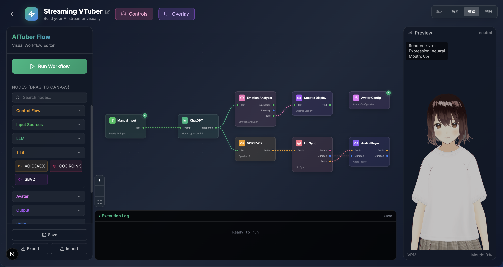

# AITuberFlow

**ノーコードでAITuberを作成できるビジュアルワークフローエディタ**

[](https://opensource.org/licenses/MIT)
[](https://www.python.org/)
[](https://nextjs.org/)
[](https://github.com/oboroge0/AITuberFlow)
[](https://github.com/oboroge0/AITuberFlow/issues)

[English](README.en.md)

---

## 概要

AITuberFlowは、AIを活用したバーチャル配信者（AITuber）のパイプラインを視覚的に構築できるツールです。ノードをドラッグ＆ドロップで配置し、接続するだけで、コードを書かずにAIキャラクターを作成できます。

### 主な特徴

- **ビジュアルエディタ** - 直感的なドラッグ＆ドロップ操作
- **プラグインシステム** - 機能を自由に拡張可能
- **リアルタイム実行** - WebSocketによるライブログ表示
- **複数LLM対応** - OpenAI, Anthropic Claude, Google Gemini, Ollama
- **複数TTS対応** - VOICEVOX, COEIROINK, Style-Bert-VITS2
- **制御フロー** - Start, End, Loop, ForEach, Switchノードで複雑なフローを構築
- **アバター対応** - VRMモデル表示、リップシンク、表情制御
- **OBS連携** - シーン切り替え、ソース制御
- **配信オーバーレイ** - OBS Browser Source対応のオーバーレイ

---

## 🚧 開発状況

> **⚡ 急ピッチで開発中！**
>
> 「みんなに早く使ってほしい！」という想いで爆速開発しています。
> 粗削りな部分もありますが、日々改善中です。
>
> - 🐛 バグを見つけたら → [Issue](https://github.com/oboroge0/AITuberFlow/issues)へ
> - 💡 こんな機能ほしい！→ [Discussions](https://github.com/oboroge0/AITuberFlow/discussions)へ
> - ⭐ 応援してくれる方 → Starお願いします！

---

## スクリーンショット


*ノードを接続してワークフローを構築*

---

## クイックスタート

### 必要な環境

- **Node.js** 22以上
- **Python** 3.11以上
- **uv** （推奨）[インストール方法](https://docs.astral.sh/uv/)
- **VOICEVOX** （音声合成を使用する場合）

### セットアップ

```bash
# リポジトリをクローン
git clone https://github.com/oboroge0/AITuberFlow.git
cd AITuberFlow

# 依存関係をインストール
make install

# 開発サーバーを起動（フロントエンド + バックエンド同時起動）
make dev
```

これで `http://localhost:3000` でエディタが開きます。

### 個別に起動する場合

```bash
# フロントエンドのみ
make dev-frontend

# バックエンドのみ
make dev-backend
```

---

## 機能

### 制御フローノード
| ノード | 説明 |
|--------|------|
| **Start** | ワークフローの開始点 |
| **End** | ワークフローの終了点 |
| **Loop** | 指定回数の繰り返し処理 |
| **ForEach** | リスト内の各アイテムに対して処理 |
| **Switch** | 条件分岐 |
| **Delay** | 遅延処理 |

### 入力ノード
| ノード | 説明 |
|--------|------|
| **Manual Input** | テキストを手動入力 |
| **YouTube Chat** | YouTubeライブのチャットを取得 |
| **Twitch Chat** | Twitchチャットを取得 |
| **Discord Chat** | Discordチャンネルのメッセージを取得 |
| **Timer** | 定期的にトリガーを発火 |

### LLMノード
| ノード | 説明 |
|--------|------|
| **ChatGPT** | OpenAI GPTモデル (GPT-4o, GPT-5等) |
| **Claude** | Anthropic Claudeモデル |
| **Gemini** | Google Geminiモデル |
| **Ollama** | ローカルLLM (Ollama経由) |

### TTSノード（音声合成）
| ノード | 説明 |
|--------|------|
| **VOICEVOX** | 無料の日本語音声合成 |
| **COEIROINK** | 高品質な日本語音声合成 |
| **Style-Bert-VITS2** | 感情豊かな音声合成 |

### アバターノード
| ノード | 説明 |
|--------|------|
| **Avatar Configuration** | VRMモデルと設定を構成 |
| **Motion Trigger** | アバターのアニメーションをトリガー |
| **Lip Sync** | 音声に合わせた口の動き |
| **Emotion Analyzer** | テキストから感情を分析して表情を設定 |

### ユーティリティノード
| ノード | 説明 |
|--------|------|
| **HTTP Request** | 外部APIを呼び出し |
| **Text Transform** | テキストを加工（大文字/小文字/トリム等） |
| **Random** | ランダムな数値や選択を生成 |
| **Variable** | 変数の保存と取得 |
| **Data Formatter** | データの整形と変換 |

### 出力ノード
| ノード | 説明 |
|--------|------|
| **Console Output** | ログに出力 |
| **Audio Player** | 合成した音声を再生 |
| **Subtitle Display** | オーバーレイに字幕を表示 |

### OBS連携ノード
| ノード | 説明 |
|--------|------|
| **OBS Scene Switch** | OBSのシーンを切り替え |
| **OBS Source Toggle** | OBSのソースを表示/非表示 |

> **注意:** OBS連携には追加の依存関係が必要です。[オプション依存関係](#オプション依存関係)を参照してください。

---

## 使い方

### 基本的な流れ

1. ブラウザで `http://localhost:3000` を開く
2. 「New Workflow」をクリックして新しいワークフローを作成
3. サイドバーからノードをキャンバスにドラッグ
4. ノード間を接続（出力ポートから入力ポートへドラッグ）
5. ノードをクリックして設定を変更
6. 「Run Workflow」で実行

### エディタの機能

| 操作 | 説明 |
|------|------|
| **ドラッグ＆ドロップ** | サイドバーからノードを追加 |
| **接続線のドラッグ** | 接続線の端をドラッグして別のノードに繋ぎ替え |
| **右クリック** | コンテキストメニューを表示 |
| **Ctrl+Z** | 元に戻す（Undo） |
| **Ctrl+Y** | やり直し（Redo） |
| **Ctrl+C/V** | コピー＆ペースト |
| **Ctrl+S** | ワークフローを保存 |
| **Delete** | 選択したノードを削除 |

### Startノードについて

- **Startノード**を配置すると、そこから接続されたノードのみが実行されます
- Startノードに接続されていないノードは点線で表示され、実行されません
- Startノードがない場合は、すべてのノードが実行されます（後方互換性）

### サンプルワークフロー：AIチャットボット

```
[Manual Input] → [LLM] → [TTS] → [Audio Player]
```

1. **Manual Input**: テキストを入力
2. **LLM**: OpenAI APIキーとシステムプロンプトを設定
3. **TTS**: VOICEVOXのスピーカーを選択
4. **Audio Player**: 合成した音声を再生

実行すると、入力テキストに対してAIが応答し、音声で読み上げます。

### 配信オーバーレイ

OBS対応のオーバーレイは以下のURLでアクセスできます：
```
http://localhost:3000/overlay/{workflow-id}
```

OBSのブラウザソースとして透過背景で設定できます。

---

## プロジェクト構成

```
AITuberFlow/
├── apps/
│   ├── web/           # Next.js フロントエンド
│   └── server/        # FastAPI バックエンド
├── packages/
│   └── sdk/           # プラグインSDK
├── plugins/           # 公式プラグイン
│   ├── start/         # 制御フロー
│   ├── end/
│   ├── loop/
│   ├── foreach/
│   ├── manual-input/  # 入力
│   ├── youtube-chat/
│   ├── twitch-chat/
│   ├── timer/
│   ├── openai-llm/    # LLM
│   ├── anthropic-llm/
│   ├── google-llm/
│   ├── ollama-llm/
│   ├── voicevox-tts/  # TTS
│   ├── coeiroink-tts/
│   ├── sbv2-tts/
│   ├── avatar-configuration/  # アバター
│   ├── motion-trigger/
│   ├── lip-sync/
│   ├── emotion-analyzer/
│   ├── obs-scene-switch/  # OBS
│   ├── obs-source-toggle/
│   ├── console-output/    # 出力
│   ├── audio-player/
│   ├── subtitle-display/
│   ├── http-request/      # ユーティリティ
│   ├── text-transform/
│   ├── random/
│   ├── variable/
│   ├── switch/
│   └── delay/
├── templates/         # ワークフローテンプレート
└── docs/              # ドキュメント
```

---

## 詳細なセットアップ

### バックエンド

#### uv を使用する場合（推奨）

```bash
cd apps/server

# 依存関係のインストールと仮想環境の作成を一括で実行
uv sync

# 環境設定ファイルをコピー
cp .env.example .env

# サーバーを起動
uv run python main.py
```

#### pip を使用する場合

```bash
cd apps/server

# 仮想環境を作成
python -m venv .venv

# 仮想環境を有効化
# Windows:
.venv\Scripts\activate
# macOS/Linux:
source .venv/bin/activate

# 依存関係をインストール
pip install -r requirements.txt

# 環境設定ファイルをコピー
cp .env.example .env

# サーバーを起動
python main.py
```

バックエンドは `http://localhost:8001` で起動します。

### フロントエンド

```bash
cd apps/web

# 依存関係をインストール
npm install

# 環境設定ファイルをコピー
cp .env.example .env.local

# 開発サーバーを起動
npm run dev
```

フロントエンドは `http://localhost:3000` で起動します。

### VOICEVOX（オプション）

音声合成を使用する場合は、[VOICEVOX](https://voicevox.hiroshiba.jp/)をインストールして起動してください。

デフォルトでは `http://localhost:50021` に接続します。

### オプション依存関係

#### OBS連携

OBS連携は `obsws-python` を使用します（GPL-2.0ライセンス）。オプション依存関係として提供されています：

```bash
cd apps/server

# uv を使用する場合
uv pip install obsws-python

# pip を使用する場合
pip install obsws-python
```

---

## プラグイン開発

独自のノードを作成できます。

```python
from aituber_flow_sdk import BaseNode, NodeContext, Event

class MyCustomNode(BaseNode):
    async def setup(self, config: dict, context: NodeContext) -> None:
        """初期化処理"""
        self.my_setting = config.get("mySetting", "default")

    async def execute(self, inputs: dict, context: NodeContext) -> dict:
        """メイン処理"""
        input_text = inputs.get("text", "")

        # ログを出力
        await context.log(f"処理中: {input_text}")

        # 結果を返す
        return {"output": f"処理結果: {input_text}"}

    async def teardown(self) -> None:
        """終了処理"""
        pass
```

詳細は `packages/sdk/README.md` を参照してください。

---

## API ドキュメント

バックエンド起動後、`http://localhost:8001/docs` でSwagger UIを確認できます。

### 主要なエンドポイント

| メソッド | パス | 説明 |
|----------|------|------|
| GET | `/api/workflows` | ワークフロー一覧 |
| POST | `/api/workflows` | ワークフロー作成 |
| GET | `/api/workflows/{id}` | ワークフロー取得 |
| PUT | `/api/workflows/{id}` | ワークフロー更新 |
| DELETE | `/api/workflows/{id}` | ワークフロー削除 |
| POST | `/api/workflows/{id}/start` | ワークフロー実行 |
| POST | `/api/workflows/{id}/stop` | ワークフロー停止 |

---

## トラブルシューティング

### バックエンドに接続できない

- サーバーが起動しているか確認（`http://localhost:8001/health`）
- ファイアウォールの設定を確認

### VOICEVOXに接続できない

- VOICEVOXが起動しているか確認
- TTSノードのホスト設定を確認（デフォルト: `http://localhost:50021`）

### 音声が再生されない

- ブラウザの自動再生ポリシーにより、最初の再生がブロックされる場合があります
- ページをクリックしてからワークフローを実行してください

### OBSノードが動作しない

- `obsws-python` がインストールされているか確認（[オプション依存関係](#オプション依存関係)を参照）
- OBSでWebSocketサーバーを有効にする（ツール → WebSocketサーバー設定）
- ホスト、ポート、パスワードの設定を確認

---

## コントリビューション

プルリクエストを歓迎します！詳細は [CONTRIBUTING.md](CONTRIBUTING.md) を参照してください。

1. このリポジトリをフォーク
2. 機能ブランチを作成 (`git checkout -b feature/amazing-feature`)
3. 変更をコミット (`git commit -m 'Add amazing feature'`)
4. ブランチをプッシュ (`git push origin feature/amazing-feature`)
5. プルリクエストを作成

---

## ライセンス

MIT License - 詳細は [LICENSE](LICENSE) を参照してください。

> **注意:** OBS連携は `obsws-python`（GPL-2.0ライセンス）を使用します。この依存関係はオプションであり、コアパッケージには含まれていません。インストールする場合は、GPL-2.0の要件にご注意ください。

---

## 謝辞

- [React Flow](https://reactflow.dev/) - ノードエディタライブラリ
- [VOICEVOX](https://voicevox.hiroshiba.jp/) - 無料の音声合成エンジン
- [FastAPI](https://fastapi.tiangolo.com/) - Python Webフレームワーク
- [Next.js](https://nextjs.org/) - React フレームワーク
- [@pixiv/three-vrm](https://github.com/pixiv/three-vrm) - VRMモデルレンダリング

---

## ⭐ Star History

[](https://star-history.com/#oboroge0/AITuberFlow&Date)
