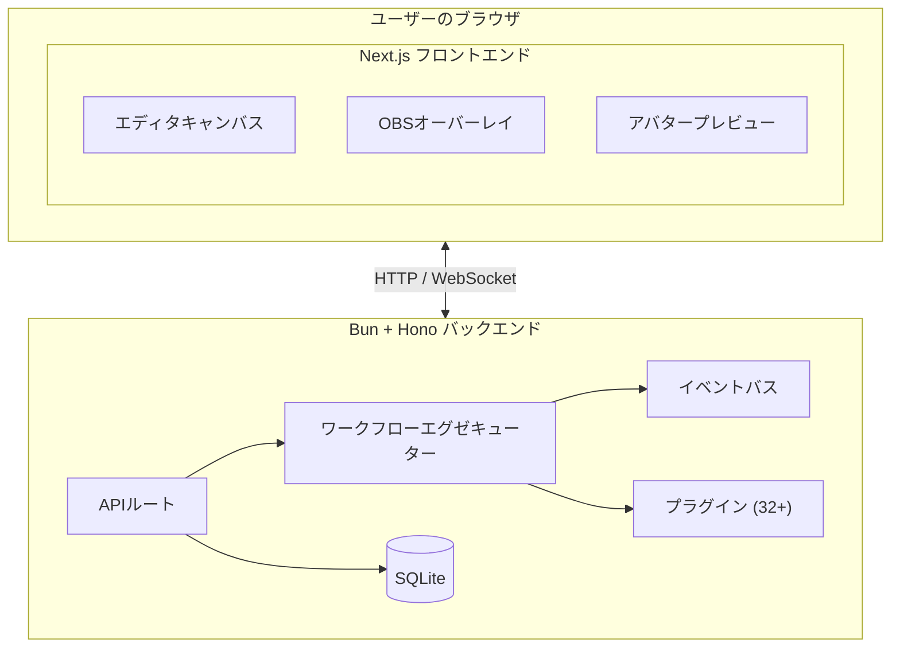
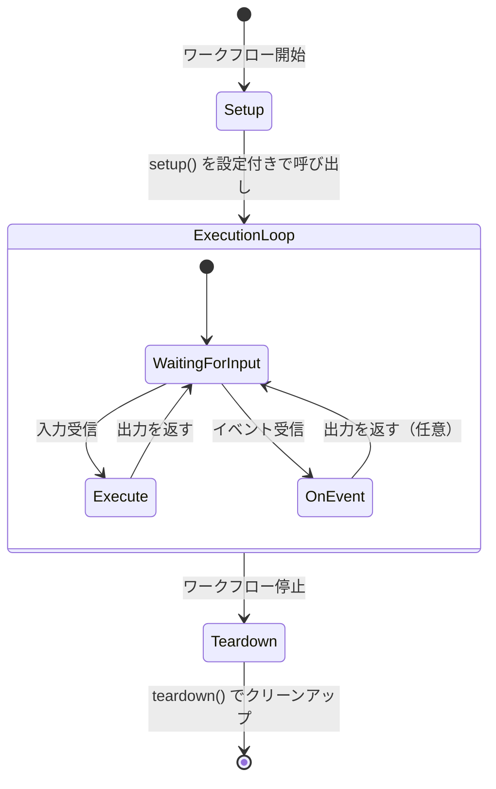
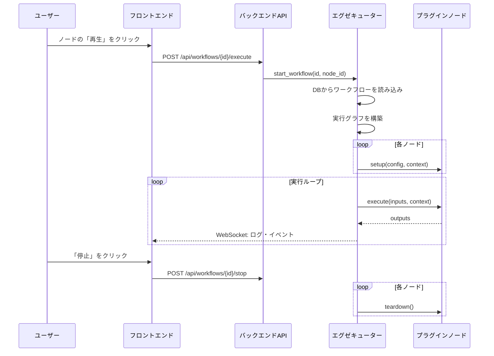

# AITuberFlow アーキテクチャ

このドキュメントでは、AITuberFlowのアーキテクチャの包括的な概要を提供し、コントリビューターがシステムの仕組みを理解できるようにします。

## 目次

- [システム概要](#システム概要)
- [高レベルアーキテクチャ](#高レベルアーキテクチャ)
- [バックエンドアーキテクチャ](#バックエンドアーキテクチャ)
  - [技術スタック](#技術スタック)
  - [ワークフローエグゼキューター](#ワークフローエグゼキューター)
  - [イベントバス](#イベントバス)
  - [APIエンドポイント](#apiエンドポイント)
- [フロントエンドアーキテクチャ](#フロントエンドアーキテクチャ)
  - [状態管理](#状態管理)
  - [エディタコンポーネント](#エディタコンポーネント)
- [プラグインシステム](#プラグインシステム)
  - [プラグイン構造](#プラグイン構造)
  - [プラグインライフサイクル](#プラグインライフサイクル)
  - [SDK概要](#sdk概要)
- [データフロー](#データフロー)
- [データベーススキーマ](#データベーススキーマ)
- [リアルタイム通信](#リアルタイム通信)

---

## システム概要

AITuberFlowは、AITuber配信セットアップを作成するための**ビジュアルワークフローエディタ**です。クライアント・サーバーアーキテクチャに従っています：

- **フロントエンド** (Next.js): ワークフローを構築・管理するビジュアルエディタ
- **バックエンド** (Bun + Hono): ワークフロー実行エンジンとAPIサーバー
- **プラグイン**: モジュラーなノード実装



**ASCIIダイアグラム（Mermaid非対応環境向け）:**

```
┌─────────────────────────────────────────────────────────────────┐
│                         ユーザーのブラウザ                        │
│  ┌──────────────────────────────────────────────────────────┐  │
│  │                    Next.js フロントエンド                  │  │
│  │  ┌─────────────┐  ┌─────────────┐  ┌─────────────────┐  │  │
│  │  │   エディタ    │  │オーバーレイ  │  │   プレビュー     │  │  │
│  │  │  キャンバス   │  │   (OBS)     │  │  (アバター)      │  │  │
│  │  └─────────────┘  └─────────────┘  └─────────────────┘  │  │
│  └──────────────────────────────────────────────────────────┘  │
└───────────────────────────┬─────────────────────────────────────┘
                            │ HTTP / Native WebSocket
                            ▼
┌─────────────────────────────────────────────────────────────────┐
│                    Bun + Hono バックエンド                       │
│  ┌─────────────┐  ┌─────────────────┐  ┌────────────────────┐  │
│  │  ルート      │  │  ワークフロー    │  │  イベントバス      │  │
│  │  (API)      │──│  エグゼキューター │──│  (リアルタイム)     │  │
│  └─────────────┘  └─────────────────┘  └────────────────────┘  │
│         │                  │                                     │
│         ▼                  ▼                                     │
│  ┌─────────────┐  ┌─────────────────┐                           │
│  │  bun:sqlite │  │  プラグイン      │                           │
│  │  + Drizzle  │  │  (32以上のノード) │                           │
│  └─────────────┘  └─────────────────┘                           │
└─────────────────────────────────────────────────────────────────┘
```

---

## 高レベルアーキテクチャ

### ディレクトリ構造

```
AITuberFlow/
├── apps/
│   ├── server-ts/             # TypeScript Bun+Hono バックエンド
│   │   ├── src/
│   │   │   ├── engine/        # ワークフロー実行エンジン
│   │   │   │   ├── executor.ts    # コア実行ロジック
│   │   │   │   ├── event-bus.ts   # イベントpub/subシステム
│   │   │   │   ├── event-queue.ts # イベントキュー
│   │   │   │   ├── plugin-loader.ts # 動的プラグイン読み込み
│   │   │   │   └── task-registry.ts # バックグラウンドタスク管理
│   │   │   ├── routes/        # APIエンドポイント
│   │   │   │   ├── workflows.ts   # ワークフローCRUD & 実行
│   │   │   │   ├── plugins.ts     # プラグイン管理
│   │   │   │   ├── templates.ts   # ワークフローテンプレート
│   │   │   │   └── integrations.ts # VTube Studio等
│   │   │   ├── models/        # Zodスキーマ
│   │   │   ├── db/            # Drizzle ORM + bun:sqlite
│   │   │   ├── websocket/     # Native WebSocketハンドラー
│   │   │   ├── state/         # キャラクター・ストリーム状態
│   │   │   ├── integrations/  # 外部サービス連携
│   │   │   └── index.ts       # サーバーエントリーポイント
│   │   └── package.json
│   │
│   └── web/                   # Next.js フロントエンド
│       ├── app/               # App Routerページ
│       │   ├── (editor)/      # エディタ & プレビューページ
│       │   └── (overlay)/     # OBSオーバーレイページ
│       ├── components/        # Reactコンポーネント
│       │   ├── editor/        # Canvas, Sidebar, CustomNode
│       │   ├── avatar/        # VRMレンダリング, リップシンク
│       │   └── panels/        # 設定, ログ, モーション
│       ├── stores/            # Zustand状態管理
│       ├── hooks/             # カスタムReactフック
│       └── lib/               # ユーティリティ, 型, APIクライアント
│
├── packages/
│   └── sdk-ts/                # TypeScript プラグインSDK
│       └── src/
│           ├── base.ts        # BaseNodeクラス
│           ├── context.ts     # NodeContext, Event
│           ├── types.ts       # Zod型定義
│           ├── errors.ts      # エラーハンドリング
│           └── index.ts       # エクスポート
│
├── plugins/                   # ノードプラグイン (32以上の公式)
│   ├── openai-llm/
│   │   ├── manifest.json      # ノードメタデータ & 設定
│   │   └── node.ts            # ノード実装
│   └── ...
│
├── tests/                     # テストスイート
│   ├── engine/                # TypeScriptエンジンテスト (bun:test)
│   └── routes/                # TypeScriptルートテスト (bun:test)
│
└── templates/                 # ワークフローテンプレート (JSON)
```

---

## バックエンドアーキテクチャ

### 技術スタック

| 項目 | 技術 |
|------|------|
| Runtime | Bun |
| Framework | Hono |
| Database | bun:sqlite + Drizzle ORM |
| WebSocket | Native WebSocket (Hono/Bun) |
| Validation | Zod |
| Package Manager | bun |
| Plugin SDK | `@aituber-flow/sdk` |

### ワークフローエグゼキューター

`WorkflowExecutor` (`apps/server-ts/src/engine/executor.ts`) はAITuberFlowの心臓部です。ワークフロー実行、ノードオーケストレーション、イベントハンドリングを管理します。

#### 主要クラス

```typescript
class NodeContext {
  /** ノードに実行コンテキストを提供します。 */
  async emitEvent(event: Event): Promise<void>;    // イベントを発火
  async log(message: string, level?: string): Promise<void>;  // フロントエンドにログを送信
  createTask(promise: Promise<unknown>): void;     // バックグラウンドタスクを作成
  updateCharacter(updates: Record<string, unknown>): void;  // キャラクター状態を更新
}

class EventQueue {
  /** イベント処理用のキュー。 */
  async put(event: Event): Promise<void>;
  async get(): Promise<Event>;
  isProcessing(): boolean;
}

class WorkflowExecutor {
  /** ワークフロー実行をオーケストレーションします。 */
  async startWorkflow(workflowId: string, startNodeId: string): Promise<void>;
  async stopWorkflow(workflowId: string): Promise<void>;
  getStatus(workflowId: string): ExecutionStatus;
}
```

#### 実行モード

エグゼキューターは2つの実行モードをサポートします：

1. **リニアモード**: 接続に従った順次実行
   - 標準的なリクエスト・レスポンスフローに使用
   - トポロジカル順でノードを実行

2. **イベント駆動モード**: イベントに基づくリアクティブ実行
   - `event_filter` 設定を持つノードに使用
   - ノードは特定のイベントタイプに反応

```typescript
// リニア実行フロー
async _runLinear(workflowId: string, startNodeId: string) {
  const order = this.getExecutionOrderFrom(workflow, startNodeId);
  for (const nodeId of order) {
    const outputs = await this.executeNode(nodeId, inputs);
    // 下流ノードに出力を渡す
  }
}

// イベント駆動実行フロー
async _runEventDriven(workflowId: string, sourceNodes: string[]) {
  while (this.workflows.get(workflowId)?.status === "running") {
    const event = await eventQueue.get();
    for (const node of matchingNodes) {
      await this.executeNodeRuntime(node, event);
    }
  }
}
```

### イベントバス

`EventBus` (`apps/server-ts/src/engine/event-bus.ts`) はリアルタイム通信のためのpublish-subscribeシステムを提供します。

```typescript
interface Event {
  type: string;           // 例: "avatar.expression", "audio.play"
  payload: Record<string, unknown>;  // イベント固有のデータ
  source?: string;        // 発生元ノードID (任意)
  timestamp: string;
}

interface EventFilter {
  typePattern: string;    // Globパターン, 例: "avatar.*"
  conditions?: Record<string, unknown>;  // ペイロード条件
}

class EventBus {
  async emit(event: Event): Promise<void>;
  subscribe(typePattern: string, callback: (event: Event) => void): string;
  unsubscribe(subscriptionId: string): void;
}
```

#### 主要イベント

| イベントタイプ | ペイロード | 説明 |
|------------|---------|-------------|
| `avatar.expression` | `{expression, intensity}` | アバター表情変更 |
| `avatar.mouth` | `{value: 0.0-1.0}` | リップシンク口の位置 |
| `avatar.motion` | `{motion, fadeIn, loop}` | アニメーショントリガー |
| `audio.play` | `{url, volume}` | 音声ファイル再生 |
| `audio.stop` | `{}` | 音声再生停止 |
| `subtitle` | `{text, duration}` | 字幕表示 |

### APIエンドポイント

#### ワークフロールート (`/api/workflows`)

| メソッド | エンドポイント | 説明 |
|--------|----------|-------------|
| GET | `/` | 全ワークフロー一覧 |
| POST | `/` | 新規ワークフロー作成 |
| GET | `/{id}` | ID指定でワークフロー取得 |
| PUT | `/{id}` | ワークフロー更新 |
| DELETE | `/{id}` | ワークフロー削除 |
| POST | `/{id}/execute` | 実行開始 |
| POST | `/{id}/stop` | 実行停止 |
| GET | `/{id}/status` | 実行ステータス取得 |

#### プラグインルート (`/api/plugins`)

| メソッド | エンドポイント | 説明 |
|--------|----------|-------------|
| GET | `/` | 利用可能な全プラグイン一覧 |

#### テンプレートルート (`/api/templates`)

| メソッド | エンドポイント | 説明 |
|--------|----------|-------------|
| GET | `/` | ワークフローテンプレート一覧 |
| GET | `/{id}` | ID指定でテンプレート取得 |

---

## フロントエンドアーキテクチャ

### 状態管理

AITuberFlowは状態管理に**Zustand**を使用し、3つの主要ストアがあります：

#### WorkflowStore (`stores/workflowStore.ts`)

```typescript
interface WorkflowState {
  // ワークフローデータ
  workflow: Workflow | null;
  nodes: Node[];
  edges: Edge[];

  // 実行状態
  executionStatus: ExecutionStatus;
  nodeLogs: Map<string, LogEntry[]>;

  // アクション
  loadWorkflow: (id: string) => Promise<void>;
  saveWorkflow: () => Promise<void>;
  addNode: (type: string, position: Position) => void;
  updateNodeConfig: (nodeId: string, config: object) => void;
  startExecution: (nodeId: string) => Promise<void>;
  stopExecution: () => Promise<void>;
}
```

#### UIPreferencesStore (`stores/uiPreferencesStore.ts`)

```typescript
interface UIPreferencesState {
  sidebarCollapsed: boolean;
  panelSizes: { left: number; right: number };
  theme: 'light' | 'dark';
}
```

#### LocaleStore (`stores/localeStore.ts`)

```typescript
interface LocaleState {
  locale: 'en' | 'ja';
  setLocale: (locale: string) => void;
}
```

### エディタコンポーネント

```
┌─────────────────────────────────────────────────────────────────┐
│                        エディタレイアウト                         │
│ ┌──────────┬──────────────────────────────────┬──────────────┐ │
│ │          │                                  │              │ │
│ │サイドバー │           キャンバス              │  ノード設定   │ │
│ │          │                                  │    パネル     │ │
│ │ - ノード  │  ┌─────┐      ┌─────┐           │              │ │
│ │  パレット │  │ノード│──────│ノード│           │ - 設定       │ │
│ │          │  └─────┘      └─────┘           │ - 入力       │ │
│ │ - 検索   │       │                          │ - 出力       │ │
│ │          │       ▼                          │              │ │
│ │          │  ┌─────┐                         │              │ │
│ │          │  │ノード│                         │              │ │
│ │          │  └─────┘                         │              │ │
│ └──────────┴──────────────────────────────────┴──────────────┘ │
│ ┌────────────────────────────────────────────────────────────┐ │
│ │                       ログパネル                            │ │
│ └────────────────────────────────────────────────────────────┘ │
└─────────────────────────────────────────────────────────────────┘
```

#### 主要コンポーネント

| コンポーネント | ファイル | 目的 |
|-----------|------|---------|
| `Canvas` | `components/editor/Canvas.tsx` | @xyflow/reactを使用したメインワークフローエディタ |
| `CustomNode` | `components/editor/CustomNode.tsx` | ノードのレンダリングと可視化 |
| `Sidebar` | `components/editor/Sidebar.tsx` | ノードパレットと検索 |
| `NodeSettings` | `components/panels/NodeSettings.tsx` | ノード設定パネル |
| `LogPanel` | `components/panels/LogPanel.tsx` | 実行ログ表示 |
| `AvatarView` | `components/avatar/AvatarView.tsx` | VRMアバターレンダリング |

---

## プラグインシステム

### プラグイン構造

各プラグインは `plugins/{plugin-id}/` に配置され、2つの必須ファイルがあります：

```
plugins/openai-llm/
├── manifest.json    # プラグインメタデータと設定スキーマ
└── node.ts          # TypeScript実装
```

### マニフェストスキーマ

```json
{
  "$schema": "https://aituber-flow.dev/schemas/plugin-manifest.json",
  "id": "openai-llm",
  "name": "OpenAI LLM",
  "version": "1.0.0",
  "description": "OpenAI GPTモデルを使用してテキストを生成",
  "author": {
    "name": "AITuberFlow Team",
    "url": "https://github.com/aituber-flow"
  },
  "license": "MIT",
  "category": "process",
  "node": {
    "inputs": [
      {"id": "prompt", "type": "string", "description": "入力プロンプト"}
    ],
    "outputs": [
      {"id": "response", "type": "string", "description": "生成されたレスポンス"}
    ],
    "events": {
      "emits": ["response.generated"],
      "listens": []
    }
  },
  "config": {
    "apiKey": {
      "type": "string",
      "label": "APIキー",
      "required": true
    },
    "model": {
      "type": "select",
      "label": "モデル",
      "default": "gpt-4o-mini",
      "options": [
        {"label": "GPT-4o Mini", "value": "gpt-4o-mini"},
        {"label": "GPT-4o", "value": "gpt-4o"}
      ]
    }
  }
}
```

### プラグインライフサイクル



**ASCIIダイアグラム（Mermaid非対応環境向け）:**

```
┌─────────────────────────────────────────────────────────────────┐
│                      プラグインライフサイクル                       │
│                                                                 │
│  ワークフロー開始                                                 │
│       │                                                         │
│       ▼                                                         │
│  ┌─────────┐                                                    │
│  │ setup() │ ← 設定で一度だけ呼び出される                          │
│  └────┬────┘                                                    │
│       │                                                         │
│       ▼                                                         │
│  ┌──────────────────────────────────────┐                       │
│  │         実行ループ                    │                       │
│  │  ┌───────────┐    ┌───────────────┐ │                       │
│  │  │ execute() │ or │  onEvent()    │ │ ← サイクルごとに呼び出し │
│  │  └───────────┘    └───────────────┘ │                       │
│  └──────────────────────────────────────┘                       │
│       │                                                         │
│       ▼                                                         │
│  ┌────────────┐                                                 │
│  │ teardown() │ ← 停止時に一度だけ呼び出される                      │
│  └────────────┘                                                 │
└─────────────────────────────────────────────────────────────────┘
```

### SDK概要

プラグインSDK (`packages/sdk-ts/src/`) は基底クラスを提供します：

```typescript
import { BaseNode, NodeContext, Event } from "@aituber-flow/sdk";

class MyNode extends BaseNode {
  async setup(config: Record<string, unknown>, context: NodeContext): Promise<void> {
    /** リソース、接続、キャッシュデータを初期化。 */
    this.apiKey = config.apiKey as string;
  }

  async execute(inputs: Record<string, unknown>, context: NodeContext): Promise<Record<string, unknown>> {
    /** 入力を処理して出力を返す。 */
    const result = await this.process(inputs.prompt as string);
    await context.log(`処理完了: ${result.slice(0, 50)}...`);
    return { response: result };
  }

  async onEvent(event: Event, context: NodeContext): Promise<Record<string, unknown> | null> {
    /** 受信イベントに反応（任意）。 */
    if (event.type === "chat.message") {
      return await this.execute({ prompt: event.payload.text }, context);
    }
    return null;
  }

  async teardown(): Promise<void> {
    /** リソースをクリーンアップ。 */
  }
}
```

#### ノードカテゴリ

| カテゴリ | 目的 |
|----------|---------|
| `input` | データソース（入力なし、出力を生成） |
| `process` | データ変換 |
| `output` | データシンク（入力を消費、出力なし） |
| `control` | フロー制御（switch, loop, delay） |

---

## データフロー

### ワークフロー実行フロー



**ASCIIダイアグラム（Mermaid非対応環境向け）:**

```
┌────────────────────────────────────────────────────────────────────┐
│                    ワークフロー実行フロー                            │
│                                                                    │
│  1. ユーザーがノードの「再生」をクリック                               │
│            │                                                       │
│            ▼                                                       │
│  2. フロントエンドが POST /api/workflows/{id}/execute を送信         │
│            │                                                       │
│            ▼                                                       │
│  3. バックエンドがデータベースからワークフローを読み込み                 │
│            │                                                       │
│            ▼                                                       │
│  4. エグゼキューターが実行グラフを構築                                 │
│     - 開始ノードからのトポロジカルソート                               │
│     - イベント駆動 vs リニアノードを識別                              │
│            │                                                       │
│            ▼                                                       │
│  5. エグゼキューターが全ノードで setup() を呼び出し                    │
│            │                                                       │
│            ▼                                                       │
│  6. 実行ループ:                                                     │
│     ┌─────────────────────────────────────┐                       │
│     │  順番に各ノードについて:              │                       │
│     │   - 接続から入力を収集               │                       │
│     │   - execute(inputs) を呼び出し       │                       │
│     │   - 下流用に出力を保存               │                       │
│     │   - イベントを発火（あれば）          │                       │
│     │   - WebSocket経由でログを送信         │                       │
│     └─────────────────────────────────────┘                       │
│            │                                                       │
│            ▼                                                       │
│  7. 停止時: 全ノードで teardown() を呼び出し                         │
│                                                                    │
└────────────────────────────────────────────────────────────────────┘
```

### リアルタイムデータフロー (WebSocket)

```
フロントエンド                        バックエンド
   │                                 │
   │──── connect (workflow_id) ─────▶│
   │                                 │
   │◀──── node.status (running) ────│
   │                                 │
   │◀──── node.log (message) ───────│
   │                                 │
   │◀──── event (avatar.expression) │
   │                                 │
   │◀──── node.output (data) ───────│
   │                                 │
   │──── node.input (data) ─────────▶│ (manual-inputノード用)
   │                                 │
   │──── stop ──────────────────────▶│
   │                                 │
```

---

## データベーススキーマ

TypeScriptバックエンドはDrizzle ORM + bun:sqliteを使用します。

### Workflows テーブル

| カラム | 型 | 説明 |
|--------|------|-------------|
| `id` | TEXT (PK) | 一意のワークフロー識別子 |
| `name` | TEXT | ワークフロー表示名 |
| `description` | TEXT | 任意の説明 |
| `nodes_json` | TEXT | ノード定義のJSON配列 |
| `connections_json` | TEXT | エッジ定義のJSON配列 |
| `character_json` | TEXT | キャラクター設定のJSONオブジェクト |
| `created_at` | TEXT | 作成タイムスタンプ |
| `updated_at` | TEXT | 最終更新タイムスタンプ |

### Node JSON構造

```json
{
  "id": "node-1",
  "type": "openai-llm",
  "position": {"x": 100, "y": 200},
  "data": {
    "label": "GPT ノード",
    "config": {
      "apiKey": "sk-...",
      "model": "gpt-4o-mini",
      "temperature": 0.7
    }
  }
}
```

### Connection JSON構造

```json
{
  "id": "edge-1",
  "source": "node-1",
  "sourceHandle": "response",
  "target": "node-2",
  "targetHandle": "text"
}
```

---

## リアルタイム通信

AITuberFlowはリアルタイム双方向通信に**Native WebSocket**を使用します（Socket.IOからの移行済み）。

### WebSocketメッセージプロトコル

全メッセージはJSON形式で、`type` フィールドでメッセージの種類を識別します。

#### クライアント → サーバー

| タイプ | ペイロード | 説明 |
|-------|---------|-------------|
| `join` | `{workflowId}` | ワークフロールームに参加 |
| `leave` | `{workflowId}` | ワークフロールームから退出 |
| `workflow:start` | `{workflowId, nodeId}` | 実行開始 |
| `workflow:stop` | `{workflowId}` | 実行停止 |
| `node:input` | `{workflowId, nodeId, data}` | ノードに入力を送信 |

#### サーバー → クライアント

| タイプ | ペイロード | 説明 |
|-------|---------|-------------|
| `node:status` | `{nodeId, status}` | ノードステータス変更 |
| `node:log` | `{nodeId, message, level}` | ノードログメッセージ |
| `node:output` | `{nodeId, outputs}` | ノード出力データ |
| `event` | `{type, payload}` | ワークフローイベント（アバター、音声等） |
| `workflow:status` | `{status, error?}` | ワークフローステータス変更 |

### WebSocketフック (フロントエンド)

```typescript
// hooks/useWebSocket.ts
const { connectionStatus, avatarState } = useWebSocket(workflowId);

// Native WebSocketで接続し、JSONメッセージを送受信
// 指数バックオフによる自動再接続
// アバター状態・音声再生を自動管理
```

---

## コントリビューション

AITuberFlowにコントリビュートする際：

1. **バックエンド変更**: コアロジックは `apps/server-ts/src/engine/` に集中
2. **フロントエンド変更**: コンポーネントは `apps/web/components/` に配置
3. **新規ノード**: 上記の構造に従って `plugins/` にプラグインを作成
4. **API変更**: `apps/server-ts/src/routes/` のルートを更新

詳細なガイドラインは [CONTRIBUTING.md](../CONTRIBUTING.md) を参照してください。

---

## 関連ドキュメント

- [はじめに](./getting-started.ja.md) - インストールと最初のステップ
- [APIリファレンス](./api-reference.ja.md) - RESTとWebSocket APIドキュメント
- [CLAUDE.md](../CLAUDE.md) - 開発ガイドラインとノード作成
