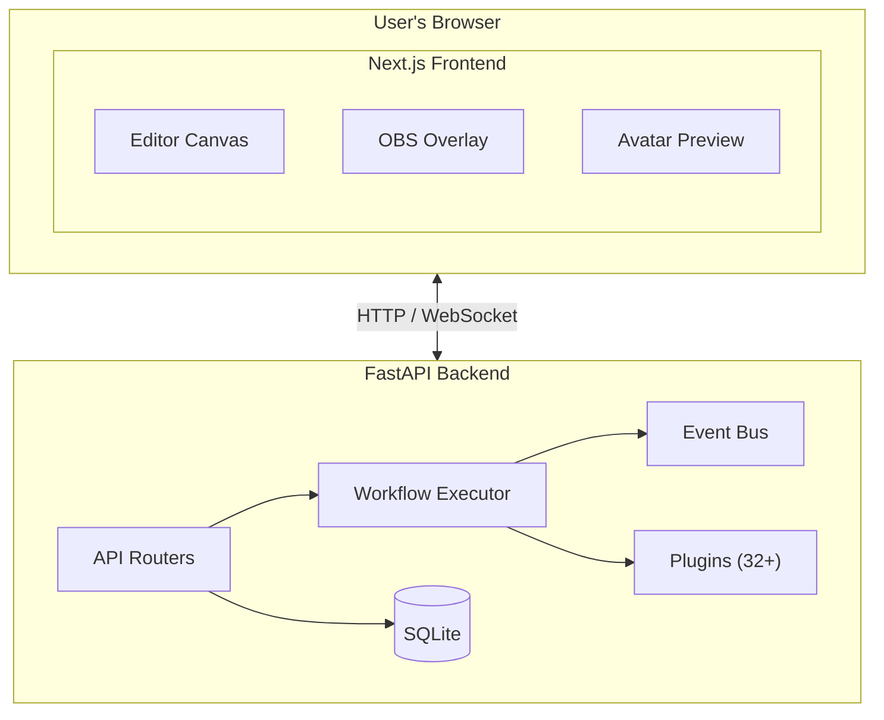
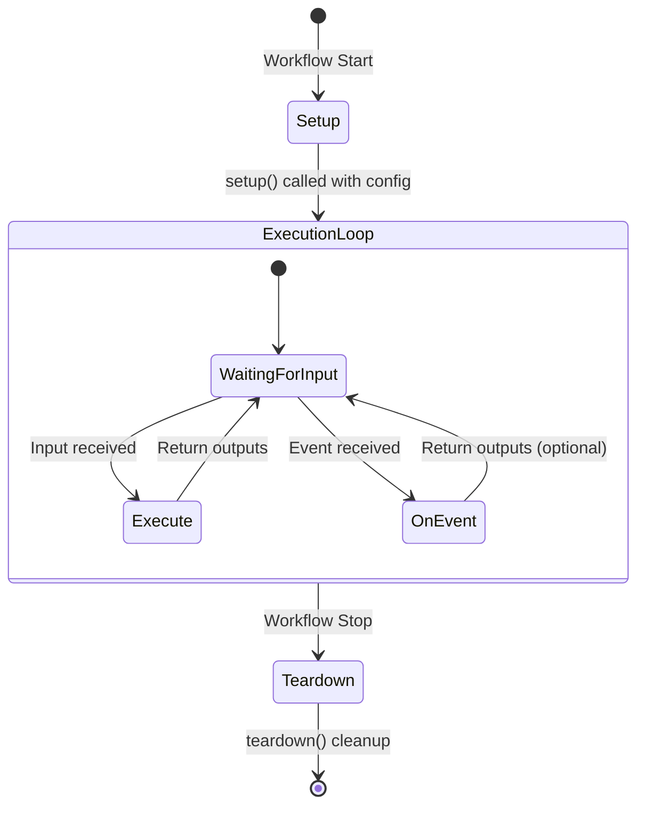
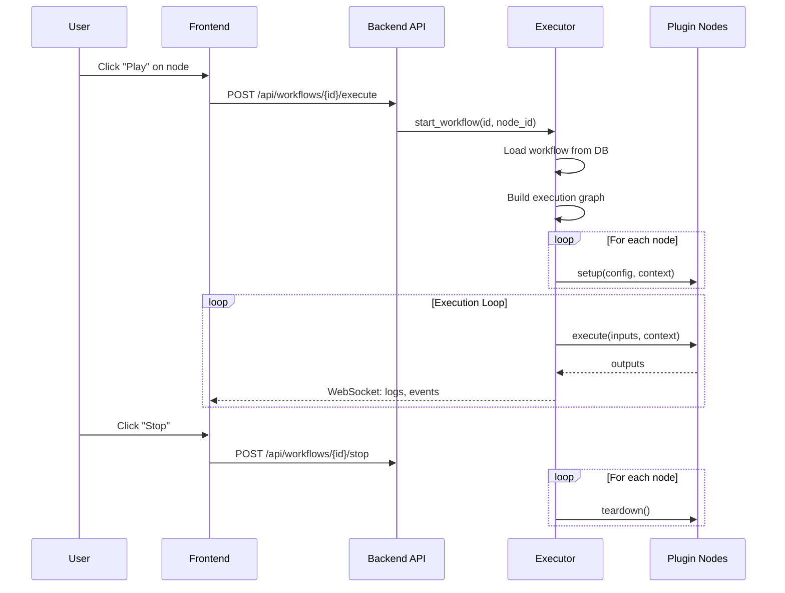

# AITuberFlow Architecture

This document provides a comprehensive overview of AITuberFlow's architecture, designed to help contributors understand how the system works.

## Table of Contents

- [System Overview](#system-overview)
- [High-Level Architecture](#high-level-architecture)
- [Backend Architecture](#backend-architecture)
  - [Workflow Executor](#workflow-executor)
  - [Event Bus](#event-bus)
  - [API Endpoints](#api-endpoints)
- [Frontend Architecture](#frontend-architecture)
  - [State Management](#state-management)
  - [Editor Components](#editor-components)
- [Plugin System](#plugin-system)
  - [Plugin Structure](#plugin-structure)
  - [Plugin Lifecycle](#plugin-lifecycle)
  - [SDK Overview](#sdk-overview)
- [Data Flow](#data-flow)
- [Database Schema](#database-schema)
- [Real-time Communication](#real-time-communication)

---

## System Overview

AITuberFlow is a **visual workflow editor** for creating AI VTuber streaming setups. It follows a client-server architecture where:

- **Frontend** (Next.js): Visual editor for building and managing workflows
- **Backend** (FastAPI): Workflow execution engine and API server
- **Plugins**: Modular node implementations (Python)



**ASCII Diagram (for terminals without Mermaid support):**

```
┌─────────────────────────────────────────────────────────────────┐
│                         User's Browser                          │
│  ┌──────────────────────────────────────────────────────────┐  │
│  │                    Next.js Frontend                       │  │
│  │  ┌─────────────┐  ┌─────────────┐  ┌─────────────────┐  │  │
│  │  │   Editor    │  │   Overlay   │  │   Preview       │  │  │
│  │  │   Canvas    │  │   (OBS)     │  │   (Avatar)      │  │  │
│  │  └─────────────┘  └─────────────┘  └─────────────────┘  │  │
│  └──────────────────────────────────────────────────────────┘  │
└───────────────────────────┬─────────────────────────────────────┘
                            │ HTTP / WebSocket
                            ▼
┌─────────────────────────────────────────────────────────────────┐
│                      FastAPI Backend                             │
│  ┌─────────────┐  ┌─────────────────┐  ┌────────────────────┐  │
│  │  Routers    │  │  Workflow       │  │  Event Bus         │  │
│  │  (API)      │──│  Executor       │──│  (Real-time)       │  │
│  └─────────────┘  └─────────────────┘  └────────────────────┘  │
│         │                  │                                     │
│         ▼                  ▼                                     │
│  ┌─────────────┐  ┌─────────────────┐                           │
│  │  SQLite DB  │  │  Plugins        │                           │
│  │  (Storage)  │  │  (32+ nodes)    │                           │
│  └─────────────┘  └─────────────────┘                           │
└─────────────────────────────────────────────────────────────────┘
```

---

## High-Level Architecture

### Directory Structure

```
AITuberFlow/
├── apps/
│   ├── server/              # Python FastAPI backend
│   │   ├── engine/          # Workflow execution engine
│   │   │   ├── executor.py  # Core execution logic (~1,130 lines)
│   │   │   └── event_bus.py # Event pub/sub system
│   │   ├── routers/         # API endpoints
│   │   │   ├── workflows.py # Workflow CRUD & execution
│   │   │   ├── plugins.py   # Plugin management
│   │   │   ├── templates.py # Workflow templates
│   │   │   └── integrations.py # VTube Studio, etc.
│   │   ├── models/          # Pydantic schemas
│   │   ├── db/              # SQLAlchemy database
│   │   └── main.py          # Server entry point
│   │
│   └── web/                 # Next.js frontend
│       ├── app/             # App Router pages
│       │   ├── (editor)/    # Editor & Preview pages
│       │   └── (overlay)/   # OBS overlay page
│       ├── components/      # React components
│       │   ├── editor/      # Canvas, Sidebar, CustomNode
│       │   ├── avatar/      # VRM rendering, lip-sync
│       │   └── panels/      # Settings, Logs, Motions
│       ├── stores/          # Zustand state management
│       ├── hooks/           # Custom React hooks
│       └── lib/             # Utilities, types, API client
│
├── packages/
│   └── sdk/                 # Python Plugin SDK
│       └── aituber_flow_sdk/
│           ├── base.py      # BaseNode class
│           ├── context.py   # NodeContext, Event
│           └── types.py     # Type definitions
│
├── plugins/                 # Node plugins (32+ official)
│   ├── openai-llm/
│   │   ├── manifest.json    # Node metadata & config
│   │   └── node.py          # Node implementation
│   └── ...
│
└── templates/               # Workflow templates (JSON)
```

---

## Backend Architecture

### Workflow Executor

The `WorkflowExecutor` (`apps/server/engine/executor.py`) is the heart of AITuberFlow. It manages workflow execution, node orchestration, and event handling.

#### Key Classes

```python
class NodeContext:
    """Provides execution context to nodes."""
    async def emit_event(event: Event) -> None    # Emit events
    async def log(message: str, level: str) -> None  # Send logs to frontend
    def create_task(coroutine) -> Task            # Create background tasks
    def update_character(updates: dict) -> None   # Update character state

class EventQueue:
    """Thread-safe queue for event processing."""
    async def put(event: Event) -> None
    async def get() -> Event
    def is_processing() -> bool

class WorkflowExecutor:
    """Orchestrates workflow execution."""
    async def start_workflow(workflow_id: str, start_node_id: str) -> None
    async def stop_workflow(workflow_id: str) -> None
    def get_status(workflow_id: str) -> ExecutionStatus
```

#### Execution Modes

The executor supports two execution modes:

1. **Linear Mode**: Sequential execution following connections
   - Used for standard request-response flows
   - Executes nodes in topological order

2. **Event-Driven Mode**: Reactive execution based on events
   - Used for nodes with `event_filter` configuration
   - Nodes react to specific event types

```python
# Linear execution flow
async def _run_linear(self, workflow_id: str, start_node_id: str):
    order = self._get_execution_order_from(workflow, start_node_id)
    for node_id in order:
        outputs = await self._execute_node(node_id, inputs)
        # Pass outputs to downstream nodes

# Event-driven execution flow
async def _run_event_driven(self, workflow_id: str, source_nodes: List[str]):
    while self._workflows[workflow_id]["status"] == "running":
        event = await event_queue.get()
        for node in matching_nodes:
            await self._execute_node_runtime(node, event)
```

### Event Bus

The `EventBus` (`apps/server/engine/event_bus.py`) provides a publish-subscribe system for real-time communication.

```python
class Event:
    type: str           # e.g., "avatar.expression", "audio.play"
    payload: dict       # Event-specific data
    source: str         # Originating node ID (optional)
    timestamp: datetime

class EventFilter:
    type_pattern: str   # Glob pattern, e.g., "avatar.*"
    conditions: dict    # Payload conditions

class EventBus:
    async def emit(event: Event) -> None
    def subscribe(filter: EventFilter, callback: Callable) -> str
    def unsubscribe(subscription_id: str) -> None
```

#### Common Events

| Event Type | Payload | Description |
|------------|---------|-------------|
| `avatar.expression` | `{expression, intensity}` | Change avatar expression |
| `avatar.mouth` | `{value: 0.0-1.0}` | Lip sync mouth position |
| `avatar.motion` | `{motion, fadeIn, loop}` | Trigger animation |
| `audio.play` | `{url, volume}` | Play audio file |
| `audio.stop` | `{}` | Stop audio playback |
| `subtitle` | `{text, duration}` | Display subtitle |

### API Endpoints

#### Workflows Router (`/api/workflows`)

| Method | Endpoint | Description |
|--------|----------|-------------|
| GET | `/` | List all workflows |
| POST | `/` | Create new workflow |
| GET | `/{id}` | Get workflow by ID |
| PUT | `/{id}` | Update workflow |
| DELETE | `/{id}` | Delete workflow |
| POST | `/{id}/execute` | Start execution |
| POST | `/{id}/stop` | Stop execution |
| GET | `/{id}/status` | Get execution status |

#### Plugins Router (`/api/plugins`)

| Method | Endpoint | Description |
|--------|----------|-------------|
| GET | `/` | List all available plugins |

#### Templates Router (`/api/templates`)

| Method | Endpoint | Description |
|--------|----------|-------------|
| GET | `/` | List workflow templates |
| GET | `/{id}` | Get template by ID |

---

## Frontend Architecture

### State Management

AITuberFlow uses **Zustand** for state management with three main stores:

#### WorkflowStore (`stores/workflowStore.ts`)

```typescript
interface WorkflowState {
  // Workflow data
  workflow: Workflow | null;
  nodes: Node[];
  edges: Edge[];

  // Execution state
  executionStatus: ExecutionStatus;
  nodeLogs: Map<string, LogEntry[]>;

  // Actions
  loadWorkflow: (id: string) => Promise<void>;
  saveWorkflow: () => Promise<void>;
  addNode: (type: string, position: Position) => void;
  updateNodeConfig: (nodeId: string, config: object) => void;
  startExecution: (nodeId: string) => Promise<void>;
  stopExecution: () => Promise<void>;
}
```

#### UIPreferencesStore (`stores/uiPreferencesStore.ts`)

```typescript
interface UIPreferencesState {
  sidebarCollapsed: boolean;
  panelSizes: { left: number; right: number };
  theme: 'light' | 'dark';
}
```

#### LocaleStore (`stores/localeStore.ts`)

```typescript
interface LocaleState {
  locale: 'en' | 'ja';
  setLocale: (locale: string) => void;
}
```

### Editor Components

```
┌─────────────────────────────────────────────────────────────────┐
│                        Editor Layout                             │
│ ┌──────────┬──────────────────────────────────┬──────────────┐ │
│ │          │                                  │              │ │
│ │ Sidebar  │           Canvas                 │ NodeSettings │ │
│ │          │                                  │    Panel     │ │
│ │ - Node   │  ┌─────┐      ┌─────┐           │              │ │
│ │   palette │  │Node │──────│Node │           │ - Config     │ │
│ │          │  └─────┘      └─────┘           │ - Inputs     │ │
│ │ - Search │       │                          │ - Outputs    │ │
│ │          │       ▼                          │              │ │
│ │          │  ┌─────┐                         │              │ │
│ │          │  │Node │                         │              │ │
│ │          │  └─────┘                         │              │ │
│ └──────────┴──────────────────────────────────┴──────────────┘ │
│ ┌────────────────────────────────────────────────────────────┐ │
│ │                       Log Panel                             │ │
│ └────────────────────────────────────────────────────────────┘ │
└─────────────────────────────────────────────────────────────────┘
```

#### Key Components

| Component | File | Purpose |
|-----------|------|---------|
| `Canvas` | `components/editor/Canvas.tsx` | Main workflow editor using @xyflow/react |
| `CustomNode` | `components/editor/CustomNode.tsx` | Node rendering and visualization |
| `Sidebar` | `components/editor/Sidebar.tsx` | Node palette and search |
| `NodeSettings` | `components/panels/NodeSettings.tsx` | Node configuration panel |
| `LogPanel` | `components/panels/LogPanel.tsx` | Execution logs display |
| `AvatarView` | `components/avatar/AvatarView.tsx` | VRM avatar rendering |

---

## Plugin System

### Plugin Structure

Each plugin resides in `plugins/{plugin-id}/` with two required files:

```
plugins/openai-llm/
├── manifest.json    # Plugin metadata and configuration schema
└── node.py          # Python implementation
```

### Manifest Schema

```json
{
  "$schema": "https://aituber-flow.dev/schemas/plugin-manifest.json",
  "id": "openai-llm",
  "name": "OpenAI LLM",
  "version": "1.0.0",
  "description": "Generate text using OpenAI GPT models",
  "author": {
    "name": "AITuberFlow Team",
    "url": "https://github.com/aituber-flow"
  },
  "license": "MIT",
  "category": "process",
  "node": {
    "inputs": [
      {"id": "prompt", "type": "string", "description": "Input prompt"}
    ],
    "outputs": [
      {"id": "response", "type": "string", "description": "Generated response"}
    ],
    "events": {
      "emits": ["response.generated"],
      "listens": []
    }
  },
  "config": {
    "apiKey": {
      "type": "string",
      "label": "API Key",
      "required": true
    },
    "model": {
      "type": "select",
      "label": "Model",
      "default": "gpt-4o-mini",
      "options": [
        {"label": "GPT-4o Mini", "value": "gpt-4o-mini"},
        {"label": "GPT-4o", "value": "gpt-4o"}
      ]
    }
  },
  "dependencies": {
    "python": ["openai>=1.0.0"]
  }
}
```

### Plugin Lifecycle



**ASCII Diagram (for terminals without Mermaid support):**

```
┌─────────────────────────────────────────────────────────────────┐
│                      Plugin Lifecycle                            │
│                                                                 │
│  Workflow Start                                                 │
│       │                                                         │
│       ▼                                                         │
│  ┌─────────┐                                                    │
│  │ setup() │ ← Called once with config                          │
│  └────┬────┘                                                    │
│       │                                                         │
│       ▼                                                         │
│  ┌──────────────────────────────────────┐                       │
│  │         Execution Loop               │                       │
│  │  ┌───────────┐    ┌───────────────┐ │                       │
│  │  │ execute() │ or │  on_event()   │ │ ← Called per cycle    │
│  │  └───────────┘    └───────────────┘ │                       │
│  └──────────────────────────────────────┘                       │
│       │                                                         │
│       ▼                                                         │
│  ┌────────────┐                                                 │
│  │ teardown() │ ← Called once on stop                           │
│  └────────────┘                                                 │
└─────────────────────────────────────────────────────────────────┘
```

### SDK Overview

The Plugin SDK (`packages/sdk/aituber_flow_sdk/`) provides base classes:

```python
from aituber_flow_sdk import BaseNode, NodeContext, Event

class MyNode(BaseNode):
    async def setup(self, config: dict, context: NodeContext) -> None:
        """Initialize resources, connections, cached data."""
        self.api_key = config.get("apiKey")

    async def execute(self, inputs: dict, context: NodeContext) -> dict:
        """Process inputs and return outputs."""
        result = await self.process(inputs["prompt"])
        await context.log(f"Processed: {result[:50]}...")
        return {"response": result}

    async def on_event(self, event: Event, context: NodeContext) -> dict | None:
        """React to incoming events (optional)."""
        if event.type == "chat.message":
            return await self.execute({"prompt": event.payload["text"]}, context)
        return None

    async def teardown(self) -> None:
        """Clean up resources."""
        pass
```

#### Node Categories

| Category | Base Class | Purpose |
|----------|------------|---------|
| `input` | `InputNode` | Data sources (no inputs, generates outputs) |
| `process` | `ProcessNode` | Data transformation |
| `output` | `OutputNode` | Data sinks (consumes inputs, no outputs) |
| `control` | `BaseNode` | Flow control (switch, loop, delay) |

---

## Data Flow

### Workflow Execution Flow



**ASCII Diagram (for terminals without Mermaid support):**

```
┌────────────────────────────────────────────────────────────────────┐
│                    Workflow Execution Flow                         │
│                                                                    │
│  1. User clicks "Play" on a node                                   │
│            │                                                       │
│            ▼                                                       │
│  2. Frontend sends POST /api/workflows/{id}/execute                │
│            │                                                       │
│            ▼                                                       │
│  3. Backend loads workflow from database                           │
│            │                                                       │
│            ▼                                                       │
│  4. Executor builds execution graph                                │
│     - Topological sort from start node                             │
│     - Identifies event-driven vs linear nodes                      │
│            │                                                       │
│            ▼                                                       │
│  5. Executor calls setup() on all nodes                            │
│            │                                                       │
│            ▼                                                       │
│  6. Execution loop:                                                │
│     ┌─────────────────────────────────────┐                       │
│     │  For each node in order:            │                       │
│     │   - Gather inputs from connections  │                       │
│     │   - Call execute(inputs)            │                       │
│     │   - Store outputs for downstream    │                       │
│     │   - Emit events (if any)            │                       │
│     │   - Send logs via WebSocket         │                       │
│     └─────────────────────────────────────┘                       │
│            │                                                       │
│            ▼                                                       │
│  7. On stop: call teardown() on all nodes                          │
│                                                                    │
└────────────────────────────────────────────────────────────────────┘
```

### Real-time Data Flow (WebSocket)

```
Frontend                          Backend
   │                                 │
   │──── connect (workflow_id) ─────▶│
   │                                 │
   │◀──── node.status (running) ────│
   │                                 │
   │◀──── node.log (message) ───────│
   │                                 │
   │◀──── event (avatar.expression) │
   │                                 │
   │◀──── node.output (data) ───────│
   │                                 │
   │──── node.input (data) ─────────▶│ (for manual-input nodes)
   │                                 │
   │──── stop ──────────────────────▶│
   │                                 │
```

---

## Database Schema

AITuberFlow uses SQLite with SQLAlchemy ORM.

### Workflows Table

| Column | Type | Description |
|--------|------|-------------|
| `id` | STRING (PK) | Unique workflow identifier |
| `name` | STRING | Workflow display name |
| `description` | TEXT | Optional description |
| `nodes_json` | TEXT | JSON array of node definitions |
| `connections_json` | TEXT | JSON array of edge definitions |
| `character_json` | TEXT | JSON object for character config |
| `created_at` | DATETIME | Creation timestamp |
| `updated_at` | DATETIME | Last update timestamp |

### Node JSON Structure

```json
{
  "id": "node-1",
  "type": "openai-llm",
  "position": {"x": 100, "y": 200},
  "data": {
    "label": "GPT Node",
    "config": {
      "apiKey": "sk-...",
      "model": "gpt-4o-mini",
      "temperature": 0.7
    }
  }
}
```

### Connection JSON Structure

```json
{
  "id": "edge-1",
  "source": "node-1",
  "sourceHandle": "response",
  "target": "node-2",
  "targetHandle": "text"
}
```

---

## Real-time Communication

AITuberFlow uses **Socket.IO** for real-time bidirectional communication.

### WebSocket Events

#### Client → Server

| Event | Payload | Description |
|-------|---------|-------------|
| `join` | `{workflow_id}` | Join workflow room |
| `leave` | `{workflow_id}` | Leave workflow room |
| `workflow:start` | `{workflow_id, node_id}` | Start execution |
| `workflow:stop` | `{workflow_id}` | Stop execution |
| `node:input` | `{workflow_id, node_id, data}` | Send input to node |

#### Server → Client

| Event | Payload | Description |
|-------|---------|-------------|
| `node:status` | `{node_id, status}` | Node status change |
| `node:log` | `{node_id, message, level}` | Node log message |
| `node:output` | `{node_id, outputs}` | Node output data |
| `event` | `{type, payload}` | Workflow event (avatar, audio, etc.) |
| `workflow:status` | `{status, error?}` | Workflow status change |

### WebSocket Hook (Frontend)

```typescript
// hooks/useWebSocket.ts
const { socket, isConnected } = useWebSocket(workflowId);

useEffect(() => {
  socket.on('node:log', (data) => {
    addLog(data.node_id, data.message, data.level);
  });

  socket.on('event', (event) => {
    if (event.type === 'avatar.expression') {
      setExpression(event.payload.expression);
    }
  });
}, [socket]);
```

---

## Contributing

When contributing to AITuberFlow:

1. **Backend changes**: Focus on `apps/server/engine/` for core logic
2. **Frontend changes**: Components are in `apps/web/components/`
3. **New nodes**: Create plugins in `plugins/` following the structure above
4. **API changes**: Update routers in `apps/server/routers/`

See [CONTRIBUTING.md](../CONTRIBUTING.md) for detailed guidelines.

---

## Related Documentation

- [Getting Started Guide](./getting-started.md) - Installation and first steps
- [API Reference](./api-reference.md) - REST and WebSocket API documentation
- [CLAUDE.md](../CLAUDE.md) - Development guidelines and node creation
