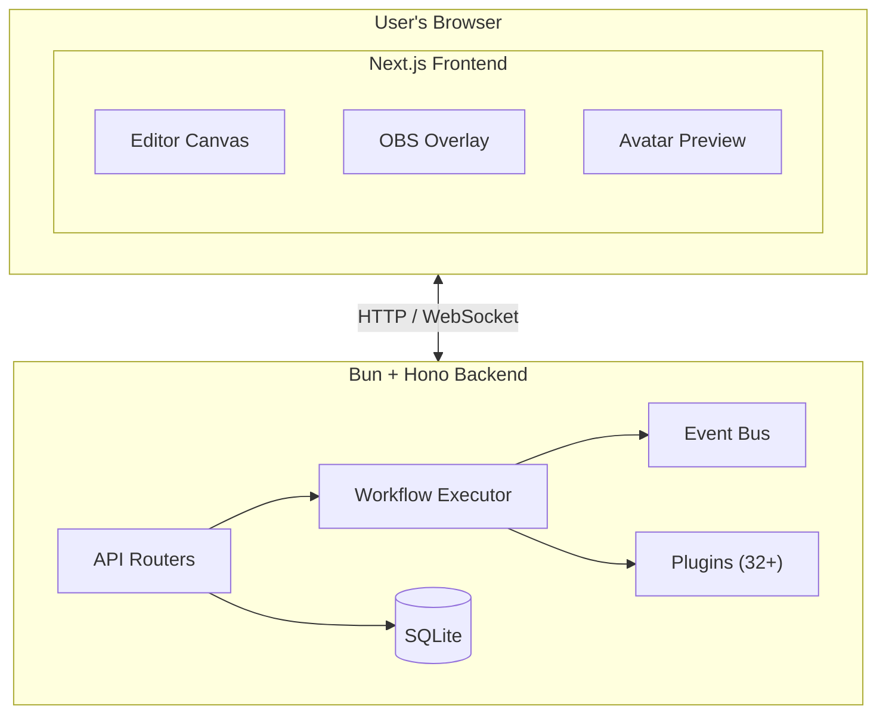
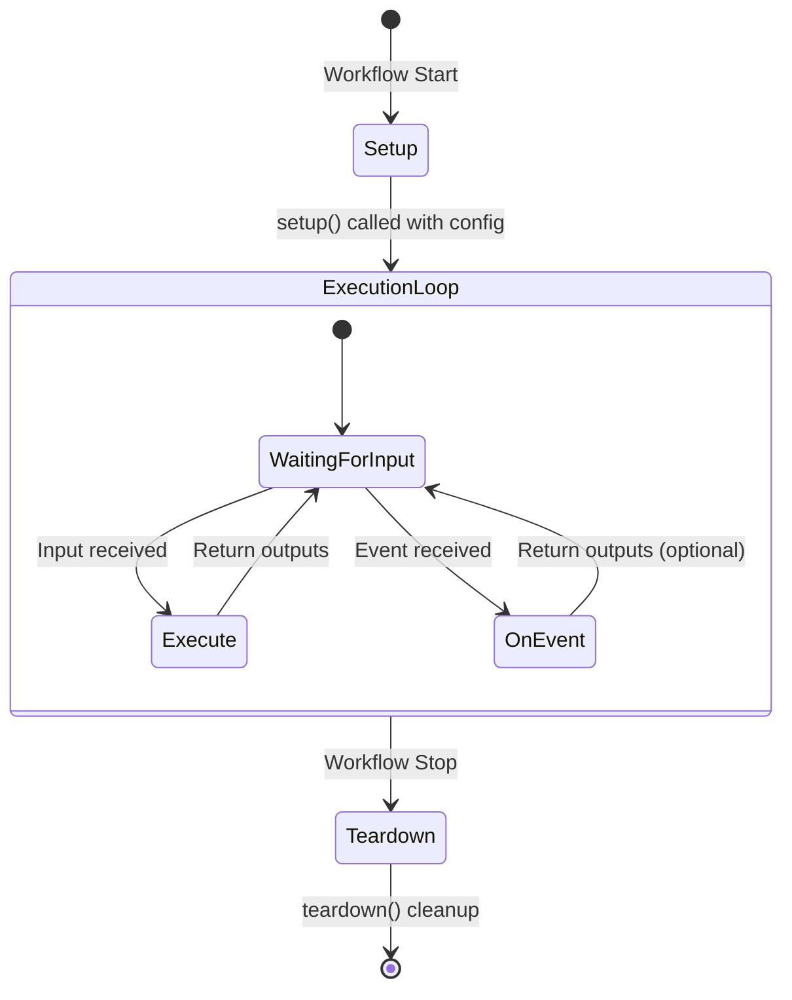
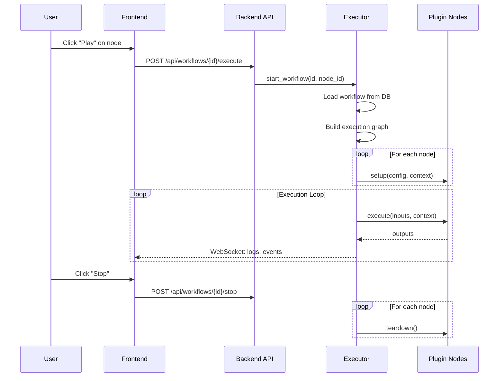

# AITuberFlow Architecture

This document provides a comprehensive overview of AITuberFlow's architecture, designed to help contributors understand how the system works.

## Table of Contents

- [System Overview](#system-overview)
- [High-Level Architecture](#high-level-architecture)
- [Backend Architecture](#backend-architecture)
  - [Workflow Executor](#workflow-executor)
  - [Event Bus](#event-bus)
  - [API Endpoints](#api-endpoints)
- [Frontend Architecture](#frontend-architecture)
  - [State Management](#state-management)
  - [Editor Components](#editor-components)
- [Plugin System](#plugin-system)
  - [Plugin Structure](#plugin-structure)
  - [Plugin Lifecycle](#plugin-lifecycle)
  - [SDK Overview](#sdk-overview)
- [Data Flow](#data-flow)
- [Database Schema](#database-schema)
- [Real-time Communication](#real-time-communication)

---

## System Overview

AITuberFlow is a **visual workflow editor** for creating AI VTuber streaming setups. It follows a client-server architecture where:

- **Frontend** (Next.js): Visual editor for building and managing workflows
- **Backend** (Bun + Hono): Workflow execution engine and API server
- **Plugins**: Modular node implementations


```mermaid
graph TB
    subgraph Browser["User's Browser"]
        subgraph Frontend["Next.js Frontend"]
            Editor["Editor Canvas"]
            Overlay["OBS Overlay"]
            Preview["Avatar Preview"]
        end
    end

    subgraph Server["Bun + Hono Backend"]
        Routers["API Routers"]
        Executor["Workflow Executor"]
        EventBus["Event Bus"]
        DB[(SQLite)]
        Plugins["Plugins (32+)"]
    end

    Browser <-->|HTTP / WebSocket| Server
    Routers --> Executor
    Executor --> EventBus
    Executor --> Plugins
    Routers --> DB
```

**ASCII Diagram (for terminals without Mermaid support):**

```
┌─────────────────────────────────────────────────────────────────┐
│                         User's Browser                          │
│  ┌──────────────────────────────────────────────────────────┐  │
│  │                    Next.js Frontend                       │  │
│  │  ┌─────────────┐  ┌─────────────┐  ┌─────────────────┐  │  │
│  │  │   Editor    │  │   Overlay   │  │   Preview       │  │  │
│  │  │   Canvas    │  │   (OBS)     │  │   (Avatar)      │  │  │
│  │  └─────────────┘  └─────────────┘  └─────────────────┘  │  │
│  └──────────────────────────────────────────────────────────┘  │
└───────────────────────────┬─────────────────────────────────────┘
                            │ HTTP / WebSocket
                            ▼
┌─────────────────────────────────────────────────────────────────┐
│                      Bun + Hono Backend                             │
│  ┌─────────────┐  ┌─────────────────┐  ┌────────────────────┐  │
│  │  Routers    │  │  Workflow       │  │  Event Bus         │  │
│  │  (API)      │──│  Executor       │──│  (Real-time)       │  │
│  └─────────────┘  └─────────────────┘  └────────────────────┘  │
│         │                  │                                     │
│         ▼                  ▼                                     │
│  ┌─────────────┐  ┌─────────────────┐                           │
│  │  SQLite DB  │  │  Plugins        │                           │
│  │  (Storage)  │  │  (32+ nodes)    │                           │
│  └─────────────┘  └─────────────────┘                           │
└─────────────────────────────────────────────────────────────────┘
```

---

## High-Level Architecture

### Directory Structure

```
AITuberFlow/
├── apps/
│   ├── server-ts/             # TypeScript Bun+Hono backend
│   │   ├── src/
│   │   │   ├── engine/        # Workflow execution engine
│   │   │   │   ├── executor.ts    # Core execution logic
│   │   │   │   ├── event-bus.ts   # Event pub/sub system
│   │   │   │   ├── event-queue.ts # Event queue
│   │   │   │   ├── plugin-loader.ts # Dynamic plugin loading
│   │   │   │   └── task-registry.ts # Background task management
│   │   │   ├── routes/        # API endpoints
│   │   │   │   ├── workflows.ts   # Workflow CRUD & execution
│   │   │   │   ├── plugins.ts     # Plugin management
│   │   │   │   ├── templates.ts   # Workflow templates
│   │   │   │   └── integrations.ts # VTube Studio, etc.
│   │   │   ├── models/        # Zod schemas
│   │   │   ├── db/            # Drizzle ORM + bun:sqlite
│   │   │   ├── websocket/     # Native WebSocket handler
│   │   │   ├── state/         # Character & stream state
│   │   │   ├── integrations/  # External service integrations
│   │   │   └── index.ts       # Server entry point
│   │   └── package.json
│   │
│   └── web/                   # Next.js frontend
│       ├── app/               # App Router pages
│       │   ├── (editor)/      # Editor & Preview pages
│       │   └── (overlay)/     # OBS overlay page
│       ├── components/        # React components
│       │   ├── editor/        # Canvas, Sidebar, CustomNode
│       │   ├── avatar/        # VRM rendering, lip-sync
│       │   └── panels/        # Settings, Logs, Motions
│       ├── stores/            # Zustand state management
│       ├── hooks/             # Custom React hooks
│       └── lib/               # Utilities, types, API client
│
├── packages/
│   └── sdk-ts/                # TypeScript Plugin SDK
│       └── src/
│           ├── base.ts        # BaseNode class
│           ├── context.ts     # NodeContext, Event
│           ├── types.ts       # Zod type definitions
│           ├── errors.ts      # Error handling
│           └── index.ts       # Exports
│
├── plugins/                   # Node plugins (32+ official)
│   ├── openai-llm/
│   │   ├── manifest.json      # Node metadata & config
│   │   └── node.ts            # Node implementation
│   └── ...
│
├── tests/                     # Test suites
│   ├── engine/                # TypeScript engine tests (bun:test)
│   └── routes/                # TypeScript route tests (bun:test)
│
└── templates/                 # Workflow templates (JSON)
```

---

## Backend Architecture

### Technology Stack

| Component | Technology |
|-----------|-----------|
| Runtime | Bun |
| Framework | Hono |
| Database | bun:sqlite + Drizzle ORM |
| WebSocket | Native WebSocket (Hono/Bun) |
| Validation | Zod |
| Package Manager | bun |
| Plugin SDK | `@aituber-flow/sdk` |

### Workflow Executor

The `WorkflowExecutor` (`apps/server-ts/src/engine/executor.ts`) is the heart of AITuberFlow. It manages workflow execution, node orchestration, and event handling.

#### Key Classes

```typescript
class NodeContext {
  /** Provides execution context to nodes. */
  async emitEvent(event: Event): Promise<void>;    // Emit events
  async log(message: string, level?: string): Promise<void>;  // Send logs to frontend
  createTask(promise: Promise<unknown>): void;     // Create background tasks
  updateCharacter(updates: Record<string, unknown>): void;  // Update character state
}

class EventQueue {
  /** Queue for event processing. */
  async put(event: Event): Promise<void>;
  async get(): Promise<Event>;
  isProcessing(): boolean;
}

class WorkflowExecutor {
  /** Orchestrates workflow execution. */
  async startWorkflow(workflowId: string, startNodeId: string): Promise<void>;
  async stopWorkflow(workflowId: string): Promise<void>;
  getStatus(workflowId: string): ExecutionStatus;
}
```

#### Execution Modes

The executor supports two execution modes:

1. **Linear Mode**: Sequential execution following connections
   - Used for standard request-response flows
   - Executes nodes in topological order

2. **Event-Driven Mode**: Reactive execution based on events
   - Used for nodes with `event_filter` configuration
   - Nodes react to specific event types

```typescript
// Linear execution flow
async _runLinear(workflowId: string, startNodeId: string) {
  const order = this.getExecutionOrderFrom(workflow, startNodeId);
  for (const nodeId of order) {
    const outputs = await this.executeNode(nodeId, inputs);
    // Pass outputs to downstream nodes
  }
}

// Event-driven execution flow
async _runEventDriven(workflowId: string, sourceNodes: string[]) {
  while (this.workflows.get(workflowId)?.status === "running") {
    const event = await eventQueue.get();
    for (const node of matchingNodes) {
      await this.executeNodeRuntime(node, event);
    }
  }
}
```

### Event Bus

The `EventBus` (`apps/server-ts/src/engine/event-bus.ts`) provides a publish-subscribe system for real-time communication.

```typescript
interface Event {
  type: string;           // e.g., "avatar.expression", "audio.play"
  payload: Record<string, unknown>;  // Event-specific data
  source?: string;        // Originating node ID (optional)
  timestamp: string;
}

interface EventFilter {
  typePattern: string;    // Glob pattern, e.g., "avatar.*"
  conditions?: Record<string, unknown>;  // Payload conditions
}

class EventBus {
  async emit(event: Event): Promise<void>;
  subscribe(typePattern: string, callback: (event: Event) => void): string;
  unsubscribe(subscriptionId: string): void;
}
```

#### Common Events

| Event Type | Payload | Description |
|------------|---------|-------------|
| `avatar.expression` | `{expression, intensity}` | Change avatar expression |
| `avatar.mouth` | `{value: 0.0-1.0}` | Lip sync mouth position |
| `avatar.motion` | `{motion, fadeIn, loop}` | Trigger animation |
| `audio.play` | `{url, volume}` | Play audio file |
| `audio.stop` | `{}` | Stop audio playback |
| `subtitle` | `{text, duration}` | Display subtitle |

### API Endpoints

#### Workflows Router (`/api/workflows`)

| Method | Endpoint | Description |
|--------|----------|-------------|
| GET | `/` | List all workflows |
| POST | `/` | Create new workflow |
| GET | `/{id}` | Get workflow by ID |
| PUT | `/{id}` | Update workflow |
| DELETE | `/{id}` | Delete workflow |
| POST | `/{id}/execute` | Start execution |
| POST | `/{id}/stop` | Stop execution |
| GET | `/{id}/status` | Get execution status |

#### Plugins Router (`/api/plugins`)

| Method | Endpoint | Description |
|--------|----------|-------------|
| GET | `/` | List all available plugins |

#### Templates Router (`/api/templates`)

| Method | Endpoint | Description |
|--------|----------|-------------|
| GET | `/` | List workflow templates |
| GET | `/{id}` | Get template by ID |

---

## Frontend Architecture

### State Management

AITuberFlow uses **Zustand** for state management with three main stores:

#### WorkflowStore (`stores/workflowStore.ts`)

```typescript
interface WorkflowState {
  // Workflow data
  workflow: Workflow | null;
  nodes: Node[];
  edges: Edge[];

  // Execution state
  executionStatus: ExecutionStatus;
  nodeLogs: Map<string, LogEntry[]>;

  // Actions
  loadWorkflow: (id: string) => Promise<void>;
  saveWorkflow: () => Promise<void>;
  addNode: (type: string, position: Position) => void;
  updateNodeConfig: (nodeId: string, config: object) => void;
  startExecution: (nodeId: string) => Promise<void>;
  stopExecution: () => Promise<void>;
}
```

#### UIPreferencesStore (`stores/uiPreferencesStore.ts`)

```typescript
interface UIPreferencesState {
  sidebarCollapsed: boolean;
  panelSizes: { left: number; right: number };
  theme: 'light' | 'dark';
}
```

#### LocaleStore (`stores/localeStore.ts`)

```typescript
interface LocaleState {
  locale: 'en' | 'ja';
  setLocale: (locale: string) => void;
}
```

### Editor Components

```
┌─────────────────────────────────────────────────────────────────┐
│                        Editor Layout                             │
│ ┌──────────┬──────────────────────────────────┬──────────────┐ │
│ │          │                                  │              │ │
│ │ Sidebar  │           Canvas                 │ NodeSettings │ │
│ │          │                                  │    Panel     │ │
│ │ - Node   │  ┌─────┐      ┌─────┐           │              │ │
│ │   palette │  │Node │──────│Node │           │ - Config     │ │
│ │          │  └─────┘      └─────┘           │ - Inputs     │ │
│ │ - Search │       │                          │ - Outputs    │ │
│ │          │       ▼                          │              │ │
│ │          │  ┌─────┐                         │              │ │
│ │          │  │Node │                         │              │ │
│ │          │  └─────┘                         │              │ │
│ └──────────┴──────────────────────────────────┴──────────────┘ │
│ ┌────────────────────────────────────────────────────────────┐ │
│ │                       Log Panel                             │ │
│ └────────────────────────────────────────────────────────────┘ │
└─────────────────────────────────────────────────────────────────┘
```

#### Key Components

| Component | File | Purpose |
|-----------|------|---------|
| `Canvas` | `components/editor/Canvas.tsx` | Main workflow editor using @xyflow/react |
| `CustomNode` | `components/editor/CustomNode.tsx` | Node rendering and visualization |
| `Sidebar` | `components/editor/Sidebar.tsx` | Node palette and search |
| `NodeSettings` | `components/panels/NodeSettings.tsx` | Node configuration panel |
| `LogPanel` | `components/panels/LogPanel.tsx` | Execution logs display |
| `AvatarView` | `components/avatar/AvatarView.tsx` | VRM avatar rendering |

---

## Plugin System

### Plugin Structure

Each plugin resides in `plugins/{plugin-id}/` with two required files:

```
plugins/openai-llm/
├── manifest.json    # Plugin metadata and configuration schema
└── node.ts          # TypeScript implementation
```

### Manifest Schema

```json
{
  "$schema": "https://aituber-flow.dev/schemas/plugin-manifest.json",
  "id": "openai-llm",
  "name": "OpenAI LLM",
  "version": "1.0.0",
  "description": "Generate text using OpenAI GPT models",
  "author": {
    "name": "AITuberFlow Team",
    "url": "https://github.com/aituber-flow"
  },
  "license": "MIT",
  "category": "process",
  "node": {
    "inputs": [
      {"id": "prompt", "type": "string", "description": "Input prompt"}
    ],
    "outputs": [
      {"id": "response", "type": "string", "description": "Generated response"}
    ],
    "events": {
      "emits": ["response.generated"],
      "listens": []
    }
  },
  "config": {
    "apiKey": {
      "type": "string",
      "label": "API Key",
      "required": true
    },
    "model": {
      "type": "select",
      "label": "Model",
      "default": "gpt-4o-mini",
      "options": [
        {"label": "GPT-4o Mini", "value": "gpt-4o-mini"},
        {"label": "GPT-4o", "value": "gpt-4o"}
      ]
    }
  }
}
```

### Plugin Lifecycle


```mermaid
stateDiagram-v2
    [*] --> Setup: Workflow Start
    Setup --> ExecutionLoop: setup() called with config

    state ExecutionLoop {
        [*] --> WaitingForInput
        WaitingForInput --> Execute: Input received
        WaitingForInput --> OnEvent: Event received
        Execute --> WaitingForInput: Return outputs
        OnEvent --> WaitingForInput: Return outputs (optional)
    }

    ExecutionLoop --> Teardown: Workflow Stop
    Teardown --> [*]: teardown() cleanup
```

**ASCII Diagram (for terminals without Mermaid support):**

```
┌─────────────────────────────────────────────────────────────────┐
│                      Plugin Lifecycle                            │
│                                                                 │
│  Workflow Start                                                 │
│       │                                                         │
│       ▼                                                         │
│  ┌─────────┐                                                    │
│  │ setup() │ ← Called once with config                          │
│  └────┬────┘                                                    │
│       │                                                         │
│       ▼                                                         │
│  ┌──────────────────────────────────────┐                       │
│  │         Execution Loop               │                       │
│  │  ┌───────────┐    ┌───────────────┐ │                       │
│  │  │ execute() │ or │  onEvent()    │ │ ← Called per cycle    │
│  │  └───────────┘    └───────────────┘ │                       │
│  └──────────────────────────────────────┘                       │
│       │                                                         │
│       ▼                                                         │
│  ┌────────────┐                                                 │
│  │ teardown() │ ← Called once on stop                           │
│  └────────────┘                                                 │
└─────────────────────────────────────────────────────────────────┘
```

### SDK Overview

The Plugin SDK (`packages/sdk-ts/src/`) provides base classes:

```typescript
import { BaseNode, NodeContext, Event } from "@aituber-flow/sdk";

class MyNode extends BaseNode {
  async setup(config: Record<string, unknown>, context: NodeContext): Promise<void> {
    /** Initialize resources, connections, cached data. */
    this.apiKey = config.apiKey as string;
  }

  async execute(inputs: Record<string, unknown>, context: NodeContext): Promise<Record<string, unknown>> {
    /** Process inputs and return outputs. */
    const result = await this.process(inputs.prompt as string);
    await context.log(`Processed: ${result.slice(0, 50)}...`);
    return { response: result };
  }

  async onEvent(event: Event, context: NodeContext): Promise<Record<string, unknown> | null> {
    /** React to incoming events (optional). */
    if (event.type === "chat.message") {
      return await this.execute({ prompt: event.payload.text }, context);
    }
    return null;
  }

  async teardown(): Promise<void> {
    /** Clean up resources. */
  }
}
```

#### Node Categories

| Category | Purpose |
|----------|---------|
| `input` | Data sources (no inputs, generates outputs) |
| `process` | Data transformation |
| `output` | Data sinks (consumes inputs, no outputs) |
| `control` | Flow control (switch, loop, delay) |

---

## Data Flow

### Workflow Execution Flow


```mermaid
sequenceDiagram
    participant User
    participant Frontend
    participant API as Backend API
    participant Executor
    participant Nodes as Plugin Nodes

    User->>Frontend: Click "Play" on node
    Frontend->>API: POST /api/workflows/{id}/execute
    API->>Executor: start_workflow(id, node_id)

    Executor->>Executor: Load workflow from DB
    Executor->>Executor: Build execution graph

    loop For each node
        Executor->>Nodes: setup(config, context)
    end

    loop Execution Loop
        Executor->>Nodes: execute(inputs, context)
        Nodes-->>Executor: outputs
        Executor-->>Frontend: WebSocket: logs, events
    end

    User->>Frontend: Click "Stop"
    Frontend->>API: POST /api/workflows/{id}/stop

    loop For each node
        Executor->>Nodes: teardown()
    end
```

**ASCII Diagram (for terminals without Mermaid support):**

```
┌────────────────────────────────────────────────────────────────────┐
│                    Workflow Execution Flow                         │
│                                                                    │
│  1. User clicks "Play" on a node                                   │
│            │                                                       │
│            ▼                                                       │
│  2. Frontend sends POST /api/workflows/{id}/execute                │
│            │                                                       │
│            ▼                                                       │
│  3. Backend loads workflow from database                           │
│            │                                                       │
│            ▼                                                       │
│  4. Executor builds execution graph                                │
│     - Topological sort from start node                             │
│     - Identifies event-driven vs linear nodes                      │
│            │                                                       │
│            ▼                                                       │
│  5. Executor calls setup() on all nodes                            │
│            │                                                       │
│            ▼                                                       │
│  6. Execution loop:                                                │
│     ┌─────────────────────────────────────┐                       │
│     │  For each node in order:            │                       │
│     │   - Gather inputs from connections  │                       │
│     │   - Call execute(inputs)            │                       │
│     │   - Store outputs for downstream    │                       │
│     │   - Emit events (if any)            │                       │
│     │   - Send logs via WebSocket         │                       │
│     └─────────────────────────────────────┘                       │
│            │                                                       │
│            ▼                                                       │
│  7. On stop: call teardown() on all nodes                          │
│                                                                    │
└────────────────────────────────────────────────────────────────────┘
```

### Real-time Data Flow (WebSocket)

```
Frontend                          Backend
   │                                 │
   │──── connect (workflow_id) ─────▶│
   │                                 │
   │◀──── node.status (running) ────│
   │                                 │
   │◀──── node.log (message) ───────│
   │                                 │
   │◀──── event (avatar.expression) │
   │                                 │
   │◀──── node.output (data) ───────│
   │                                 │
   │──── node.input (data) ─────────▶│ (for manual-input nodes)
   │                                 │
   │──── stop ──────────────────────▶│
   │                                 │
```

---

## Database Schema

The TypeScript backend uses bun:sqlite with Drizzle ORM.

### Workflows Table

| Column | Type | Description |
|--------|------|-------------|
| `id` | STRING (PK) | Unique workflow identifier |
| `name` | STRING | Workflow display name |
| `description` | TEXT | Optional description |
| `nodes_json` | TEXT | JSON array of node definitions |
| `connections_json` | TEXT | JSON array of edge definitions |
| `character_json` | TEXT | JSON object for character config |
| `created_at` | DATETIME | Creation timestamp |
| `updated_at` | DATETIME | Last update timestamp |

### Node JSON Structure

```json
{
  "id": "node-1",
  "type": "openai-llm",
  "position": {"x": 100, "y": 200},
  "data": {
    "label": "GPT Node",
    "config": {
      "apiKey": "sk-...",
      "model": "gpt-4o-mini",
      "temperature": 0.7
    }
  }
}
```

### Connection JSON Structure

```json
{
  "id": "edge-1",
  "source": "node-1",
  "sourceHandle": "response",
  "target": "node-2",
  "targetHandle": "text"
}
```

---

## Real-time Communication

AITuberFlow uses **Native WebSocket** for real-time bidirectional communication (migrated from Socket.IO).

### WebSocket Message Protocol

All messages are JSON-encoded with a `type` field to identify the message kind.

#### Client → Server

| Type | Payload | Description |
|------|---------|-------------|
| `join` | `{workflowId}` | Join workflow room |
| `leave` | `{workflowId}` | Leave workflow room |
| `workflow:start` | `{workflowId, nodeId}` | Start execution |
| `workflow:stop` | `{workflowId}` | Stop execution |
| `node:input` | `{workflowId, nodeId, data}` | Send input to node |

#### Server → Client

| Type | Payload | Description |
|------|---------|-------------|
| `node:status` | `{nodeId, status}` | Node status change |
| `node:log` | `{nodeId, message, level}` | Node log message |
| `node:output` | `{nodeId, outputs}` | Node output data |
| `event` | `{type, payload}` | Workflow event (avatar, audio, etc.) |
| `workflow:status` | `{status, error?}` | Workflow status change |

### WebSocket Hook (Frontend)

```typescript
// hooks/useWebSocket.ts
const { connectionStatus, avatarState } = useWebSocket(workflowId);

// Connects via native WebSocket with JSON message protocol
// Auto-reconnection with exponential backoff
// Manages avatar state and audio playback automatically
```

---

## Contributing

When contributing to AITuberFlow:

1. **Backend changes**: Focus on `apps/server-ts/src/engine/` for core logic
2. **Frontend changes**: Components are in `apps/web/components/`
3. **New nodes**: Create plugins in `plugins/` following the structure above
4. **API changes**: Update routes in `apps/server-ts/src/routes/`

See [CONTRIBUTING.md](../CONTRIBUTING.md) for detailed guidelines.

---

## Related Documentation

- [Getting Started Guide](./getting-started.md) - Installation and first steps
- [API Reference](./api-reference.md) - REST and WebSocket API documentation
- [CLAUDE.md](../CLAUDE.md) - Development guidelines and node creation
